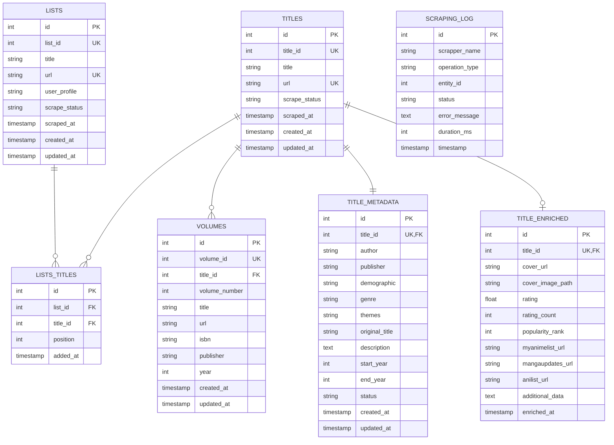
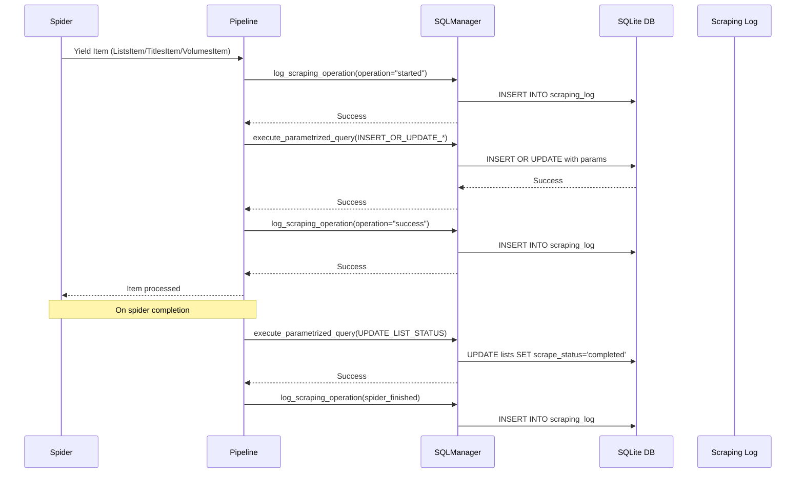
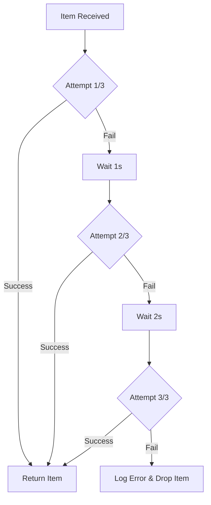
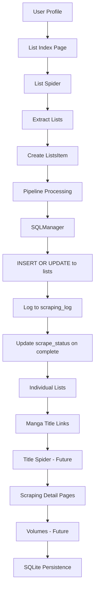

# Whakoom Manga Lists Scraper

## Overview

This project is a **Python 3.12 web scraping application** built with **Scrapy** that extracts manga collection data from a public WhaKoom user profile.

Target profile:

```
https://www.whakoom.com/deirdre/lists/
```

The profile contains **multiple user-defined lists** (e.g. by demographic, theme, or license).
Each list contains **manga titles**, and each title may appear in **multiple lists**.

The goal of the application is to:

1. Scrape all lists belonging to the user
2. Extract all unique manga titles across those lists
3. Scrape **each manga title only once**, even if it appears in multiple lists
4. Scrape detailed information for **each manga collection**, including all volumes when applicable
5. Store the scraped data in a **SQLite database** with migration support

This README is written to support:

* Human contributors
* Automated or semi-automated **AI agents** extending the project

---

## Core Concepts

### Definitions

* **User Profile**
  A WhaKoom user page that contains multiple manga lists.

* **List**
  A curated grouping of manga titles (e.g. demographic-based, publisher-based, etc.).

* **Manga Title (Collection)**
  A logical manga work.
  A single title may contain:

  * One volume
  * Multiple volumes

* **Volume / Item**
  A physical or digital release belonging to a manga title.

---

## Database Schema

The database uses **SQLite** with migration support. The schema is designed to support:

* Tracking which lists have been scraped
* Storing titles with deduplication
* Many-to-many relationships (titles ↔ lists)
* Volume information per title
* Metadata and optional enriched data

### Entity Relationship Diagram



### Table Descriptions

| Table | Purpose |
|-------|---------|
| `lists` | Stores scraped lists with scrape status |
| `titles` | Stores unique manga titles with deduplication |
| `volumes` | Stores individual volumes per title |
| `lists_titles` | Many-to-many relationship (titles appear in multiple lists) |
| `title_metadata` | Stores metadata (author, publisher, demographic, etc.) |
| `title_enriched` | Optional enriched data (covers, ratings, external API links) |
| `scraping_log` | Tracks all scraping operations with scrapper name |
| `migrations` | Tracks applied migration versions |

### Schema Requirements Met

| Requirement | Solution |
|-------------|------------|
| Which lists were scraped? | `lists.scrape_status` + `lists.scraped_at` |
| Which volumes with which IDs? | `volumes.volume_id` + `volumes.title_id` FK |
| Multiplicity (volume in multiple lists) | `lists_titles` junction table with `position` |
| Scraped vs unscraped titles | `titles.scrape_status` (pending/completed/failed) |
| Metadata | `title_metadata` table (author, publisher, etc.) |
| Optional enriched data | `title_enriched` table (all nullable, JSON column) |

---

## Spider-Database Integration

### Architecture Overview

The spiders use **Scrapy Items** and **Pipelines** to interact with the database:



### Components

**Spiders** (`spiders/`)
- Parse HTML and yield Items
- `ListSpider`: Scrapes lists, extracts `user_profile` from URL
- Use dataclasses (`ListsItem`, `TitlesItem`, `VolumesItem`)

**Pipelines** (`pipelines.py`)
- Receives Items from spiders
- Uses `SQLManager` for all DB operations
- Implements retry logic (3 attempts with exponential backoff)
- Logs all operations to `scraping_log`
- Updates statuses on spider completion

**SQLManager** (`sqlmanager.py`)
- Manages DB connections
- Loads named queries from SQL files
- Applies migrations automatically
- Provides `execute_parametrized_query()` for safe parameterized queries

**Named Queries** (`queries/`)
- Reusable SQL queries organized per table
- Format: `# QUERY_NAME` followed by SQL statement
- Use `?` placeholders for parameters (safe against SQL injection)

### Data Flow

1. Spider extracts data from HTML
2. Spider yields Item (`ListsItem`, `TitlesItem`, or `VolumesItem`)
3. Pipeline receives Item
4. Pipeline logs operation start to `scraping_log`
5. Pipeline executes named query with Item data
6. Pipeline logs operation success to `scraping_log`
7. On spider close, Pipeline updates all list statuses to "completed"
8. Pipeline logs spider completion to `scraping_log`

### Retry Logic

The pipeline implements robust error handling:



- **Max retries**: 3
- **Initial delay**: 1 second
- **Backoff**: Exponential (doubles each retry)
- **On failure**: Logs error to `scraping_log` and raises `DropItem`

---

## Migration System

### Migration Logic

The project uses a **file-based migration system** with automatic application:

**Migration File Format** (`migrations/XXX_name.sql`):
```sql
# MIGRATION_VERSION
001

# MIGRATION_NAME
initial_schema

# UP
CREATE TABLE lists (...);
CREATE TABLE titles (...);
-- ... more tables

# DOWN
DROP TABLE IF EXISTS lists;
DROP TABLE IF EXISTS titles;
-- ... more drops
```

### How Migrations Work

1. **Load Pending Migrations**: On spider start, `SQLManager` scans `migrations/` directory
2. **Check Applied**: Compares migration filenames against `migrations` table in DB
3. **Apply in Order**: Sorts migrations by filename, applies `UP` sections sequentially
4. **Track Success**: Inserts version + name into `migrations` table
5. **Rollback Support**: `DOWN` sections defined for potential future rollback (deferred)

### Migration Features

* **Version tracking**: Each migration has a unique version number
* **Named migrations**: Human-readable names for each migration
* **Idempotent**: Can run multiple times safely (using `IF NOT EXISTS`)
* **Schema evolution**: New tables added, existing tables modified
* **Rollback ready**: `DOWN` sections for future implementation

### Migration Files

| File | Version | Name | Description |
|------|----------|-------|-------------|
| `001_initial_schema.sql` | 001 | initial_schema | Creates all core tables |

---

## Functional Requirements

### Required Behavior

* Scrape **all lists** from target user profile
* Extract **all manga titles** from each list
* Ensure **deduplication**:

  * A manga title appearing in multiple lists must be scraped **once**
* Scrape **detailed data per manga title**, including:

  * Title metadata
  * Associated volumes (if applicable)
* Persist all results to a **SQLite database**
* Track scraping progress with **scrape_status** fields

### Explicit Non-Goals (for now)

* No authentication / login
* No scraping of private lists
* No API usage (HTML scraping only)
* No UI or API layer

---

## Tech Stack

* **Language:** Python 3.12
* **Scraping Framework:** Scrapy
* **Database:** SQLite
* **OS Compatibility:** Cross-platform (Linux / macOS / Windows)

---

## Project Status

✅ **Active development / schema implemented**

* Database schema **finalized** with migration support
* `ListSpider` integrated with DB and pipeline
* Migration system operational
* Logging to `scraping_log` implemented
* Retry logic with exponential backoff implemented

---

## High-Level Scraping Flow



```text
User Profile
    ↓
List Index Page
    ↓
Individual Lists
    ↓
Manga Title Links (deduplicated)
    ↓
Manga Detail Pages
    ↓
Volumes / Editions
    ↓
SQLite Persistence
```

---

## Running Spiders

### Prerequisites

1. **Install dependencies**:
   ```bash
   uv sync
   # or
   pip install -r requirements.txt
   ```

2. **Activate virtual environment** (recommended):
   ```bash
   # Windows
   .venv\Scripts\activate

   # Linux/macOS
   source .venv/bin/activate
   ```

### Running Spiders

From the project root directory:

```bash
# Scrape lists from user profile (default: deirdre)
scrapy crawl lists

# Scrape lists from a different user profile
scrapy crawl lists -a user_profile=other_user

# Run with custom output format (for testing)
scrapy crawl lists -o lists.json

# Run with debug logging
scrapy crawl lists --loglevel=DEBUG
```

### Spider Outputs

* **Database**: `databases/publications.db` (automatic)
* **Logs**: Console output with colored logging
* **Scraping Log**: Stored in `scraping_log` table
* **Statuses**: Tracked in `lists.scrape_status` field

### Helpful Commands

```bash
# View database contents (using SQLite CLI)
sqlite3 databases/publications.db "SELECT * FROM lists;"

# Check applied migrations
sqlite3 databases/publications.db "SELECT * FROM migrations;"

# View recent scraping logs
sqlite3 databases/publications.db "SELECT * FROM scraping_log ORDER BY timestamp DESC LIMIT 10;"

# Get lists by status
sqlite3 databases/publications.db "SELECT * FROM lists WHERE scrape_status='pending';"

# Get all lists for a user profile
sqlite3 databases/publications.db "SELECT * FROM lists WHERE user_profile='deirdre';"
```

---

## Expected Scrapy Components

This project includes:

* **Spiders**
  * `ListSpider` - Scrapes user lists, extracts `user_profile` from URL
  * `PublicationsSpider` - (legacy, to be updated)

* **Pipelines**
  * `WhakoomWebscrapperPipeline` - Main pipeline with:
    * SQLManager integration
    * Automatic migration application
    * Retry logic (3 attempts, exponential backoff)
    * Comprehensive logging to `scraping_log`
    * Status updates on spider completion

* **Items** (Dataclasses)
  * `ListsItem` - Lists with `list_id`, `title`, `url`, `user_profile`, `scrape_status`
  * `TitlesItem` - Manga titles with `title_id`, `title`, `url`, `scrape_status`
  * `VolumesItem` - Volumes with `volume_id`, `title_id`, `volume_number`, etc.
  * `TitleMetadataItem` - Metadata for titles
  * `TitlesListItem` - Many-to-many relationship

* **SQL Management**
  * `SQLManager` - Database and query management
  * Named queries in `queries/*.sql`
  * Migrations in `migrations/*.sql`

---

## Error Handling & Robustness

Implemented features:

* **Graceful handling of missing fields**: Dataclass fields can be `None`
* **Retry logic for transient failures**: 3 attempts with exponential backoff (1s, 2s, 4s)
* **Logging suitable for both humans and agents**: Colored console logs + database log table
* **Error tracking**: All errors logged to `scraping_log` with `error_message`
* **Safe parameterized queries**: Using `?` placeholders to prevent SQL injection

---

## Deduplication Strategy

A **manga title may appear in multiple lists**.

The scraper must:

* Identify a **stable unique identifier** per manga title (e.g. URL, WhaKoom internal ID)
* Track already-processed titles via `title_id` unique constraint
* Skip duplicate scraping while preserving list associations if needed
* Use `lists_titles` junction table to track multiplicity

This is a **hard requirement**.

---

## Ethical & Legal Notes

* Scrape responsibly
* Respect robots.txt if applicable
* Use reasonable request rates
* This project is for **personal, educational, and research use**

---

## How an AI Agent Should Approach This Project

An AI agent working on this codebase should:

1. Read the scraping flow end-to-end before coding
2. Treat schema design as **iterative** (use migrations for changes)
3. Prioritize **correctness and deduplication**
4. Avoid hardcoding list names or assumptions
5. Keep spiders composable and single-purpose
6. Prefer explicit state tracking over implicit assumptions
7. Use **SQLManager** for all database operations
8. Use **named queries** from `queries/` directory
9. Follow the **retry logic pattern** in pipelines
10. Log all operations to `scraping_log` with `scrapper_name`

---

## Future Extensions (Out of Scope, but Planned)

* Title spider implementation
* Volume spider implementation
* Export to JSON / CSV
* API layer
* Stats & analytics (e.g. demographics breakdown)
* Scheduled scraping
* Multi-user support
* Migration rollback support (DOWN sections defined but not implemented)

---

## Disclaimer

This project depends on the current HTML structure of WhaKoom.
Any changes to the site may require scraper updates.
