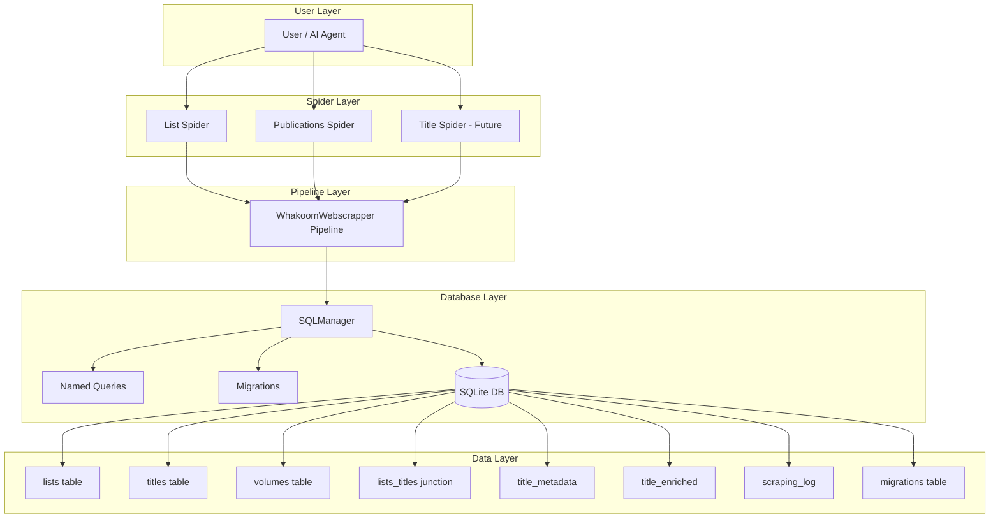
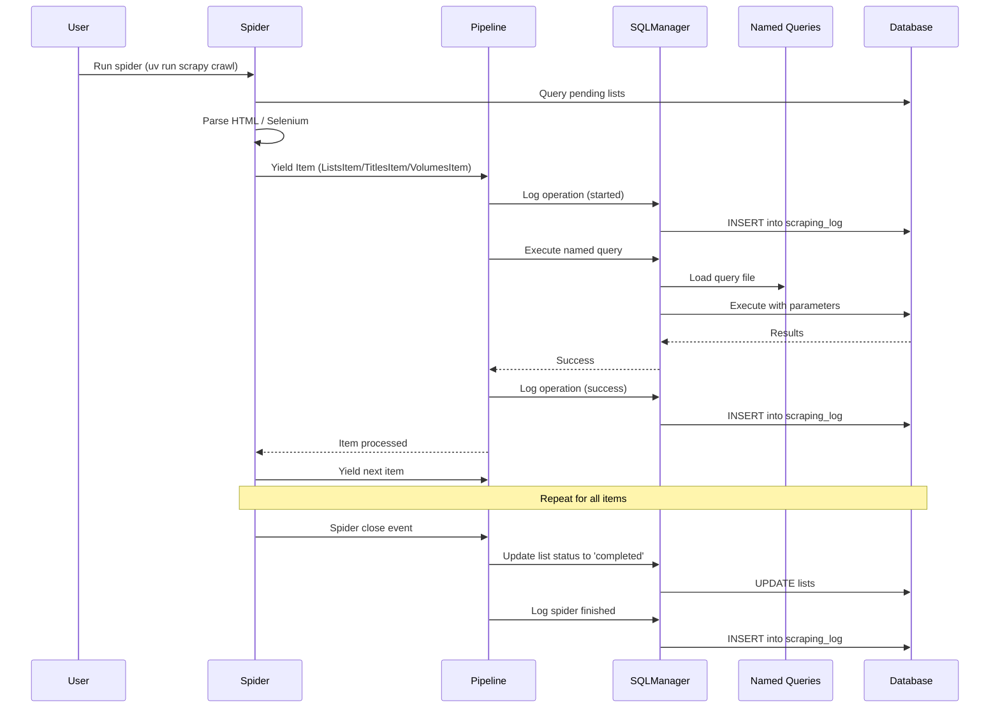

# Architecture Overview

High-level system architecture and design decisions for Whakoom Manga Lists Scraper.

---

## Project Goals

The Whakoom Manga Lists Scraper aims to:

1. **Extract manga collection data** from Whakoom user profiles
2. **Track scraping progress** with status fields and timestamps
3. **Deduplicate titles** across multiple lists (one title per series)
4. **Store structured data** in SQLite database with migration support
5. **Support incremental scraping** - only scrape new/updated data
6. **Enable analysis** - collected data supports statistical analysis, NLP, and semantic analysis

### Non-Goals

- No authentication or login functionality
- No scraping of private lists
- No API usage (HTML scraping only)
- No web UI or REST API layer
- No real-time processing (batch processing only)

---

## System Architecture

### High-Level Components



### Data Flow



---

## Components

### Spiders Layer

**Location:** `whakoom_webscrapper/spiders/`

Spiders are Scrapy spider classes that parse HTML and yield data items.

#### ListSpider (`lists.py`)
- **Purpose:** Scrape all lists from a Whakoom user profile
- **Input:** User profile URL (e.g., `https://www.whakoom.com/deirdre/lists/`)
- **Output:** ListsItem instances
- **Database Target:** `lists` table
- **Selenium:** No (uses Scrapy only)

#### PublicationsSpider (`publications.py`)
- **Purpose:** Process lists to extract volumes and titles
- **Input:** Lists from database (read by mode parameter)
- **Output:** VolumesItem, TitlesItem, TitlesListItem instances
- **Database Targets:** `volumes`, `titles`, `lists_titles` tables
- **Selenium:** Yes (for dynamic content loading)

#### TitleSpider (Future - `titles.py`)
- **Purpose:** Scrape detailed title metadata
- **Input:** Titles from database where `scrape_status='pending'`
- **Output:** TitleMetadataItem instances
- **Database Target:** `title_metadata` table
- **Selenium:** TBD

### Pipeline Layer

**Location:** `whakoom_webscrapper/pipelines.py`

The pipeline is a Scrapy item pipeline that processes items yielded by spiders.

#### WhakoomWebscrapperPipeline

**Responsibilities:**
1. **Initialize database** - Applies migrations on spider start
2. **Process items** - Handles ListsItem, TitlesItem, VolumesItem, TitlesListItem
3. **Retry logic** - 3 attempts with exponential backoff (1s, 2s, 4s)
4. **Log operations** - All operations logged to `scraping_log` table
5. **Update statuses** - Marks lists as 'completed' on spider close

**Error Handling:**
- Logs all errors to `scraping_log` table
- Raises `DropItem` after 3 failed retries
- Preserves partial progress on failure

### Database Layer

#### SQLManager

**Location:** `whakoom_webscrapper/sqlmanager.py`

A lightweight ORM-like manager that provides type-safe database operations.

**Features:**
- **Named queries** - Loads SQL queries from `.sql` files
- **Parameterized queries** - All queries use `?` placeholders (SQL injection safe)
- **ORM-like methods** - `insert()`, `update()`, `update_single_field()`, `select_by_id()`
- **Migration system** - Automatic application of pending migrations
- **Logging** - Built-in scraping operation logging

**Design Principles:**
- Simpler than full ORMs (SQLAlchemy, Django ORM)
- Explicit SQL visibility (no query hiding)
- Type-safe with Python 3.12 dataclasses
- No session management complexity

#### Named Queries

**Location:** `whakoom_webscrapper/queries/`

SQL files organized by table with named query sections.

**Format:**
```sql
# QUERY_NAME
SELECT * FROM table WHERE field = ?;

# ANOTHER_QUERY
INSERT INTO table (col1, col2) VALUES (?, ?);
```

**Benefits:**
- Reusable query definitions
- Version control for SQL
- Easy to review and modify
- Prevents string interpolation

#### Migrations

**Location:** `whakoom_webscrapper/migrations/`

Versioned SQL migration files with `Up` and `Down` sections.

**Naming Convention:** `XXX_description.sql` (e.g., `001_initial_schema.sql`)

**Format:**
```sql
-- Up
CREATE TABLE lists (...);
CREATE TABLE titles (...);

-- Down
DROP TABLE IF EXISTS lists;
DROP TABLE IF EXISTS titles;
```

**Behavior:**
- Auto-applied on spider start
- Tracked in `migrations` table
- Idempotent (safe to re-run)

---

## Design Decisions

### Why SQLite?

**Pros:**
- Zero configuration - no database server needed
- File-based - easy to backup and migrate
- Sufficient for hobby/exploratory projects
- Built-in Python support

**Cons:**
- Not suitable for high concurrency
- Limited to single-writer at a time
- No built-in replication

**Decision:** SQLite is appropriate for this project because:
- Single-user scraping workflow
- Batch processing (no real-time requirements)
- Easy to share database files
- Scales to millions of records

### Why Scrapy?

**Pros:**
- Mature, battle-tested framework
- Built-in concurrency and rate limiting
- Extensible middleware and pipelines
- Active community and documentation

**Cons:**
- Learning curve for custom features
- Overkill for simple scraping tasks

**Decision:** Scrapy provides the right balance of power and flexibility for:
- Multiple spiders with shared infrastructure
- Complex pagination and navigation
- Pipeline-based item processing
- Future scalability

### Why Dataclasses Instead of ORM?

**Pros:**
- No dependencies beyond Python stdlib
- Explicit field definitions
- Easy to understand and debug
- Full control over SQL queries

**Cons:**
- Manual to_tuple() methods
- No automatic relationship loading
- More boilerplate code

**Decision:** Dataclasses + SQLManager provides:
- Type safety with Python 3.12
- Explicit database schema visibility
- Simpler than full ORM (SQLAlchemy)
- Perfect fit for project scale

### Why Selenium Only for Publications Spider?

**Reasoning:**
- List pages are static HTML (Scrapy suffices)
- List pages use lazy loading for volumes (Selenium required)
- Volume pages are static (after navigation)

**Decision:** Use Selenium strategically:
- Only when needed (dynamic content)
- Headless mode for performance
- Driver cleanup to prevent memory leaks

---

## Technology Stack

### Core Dependencies

| Component | Technology | Version | Purpose |
|-----------|-----------|----------|---------|
| Language | Python | 3.12+ | Scripting and logic |
| Scraping | Scrapy | 2.11+ | Web scraping framework |
| Browser Automation | Selenium | 4.x+ | Dynamic content handling |
| Database | SQLite | 3.x | Data persistence |
| Package Manager | uv | Latest | Dependency management |

### Python Dependencies

Key dependencies from `pyproject.toml`:

- `scrapy` - Web scraping framework
- `selenium` - Browser automation
- `colorlog` - Colored console logging
- `lxml` - XML/HTML parsing
- `w3lib` - URL encoding utilities

### Development Tools

- `ruff` - Fast Python linter
- `black` - Code formatter
- `bandit` - Security linter
- `pre-commit` - Git hooks

---

## Data Models

### Core Entities

1. **User Profile** - Whakoom user containing lists
2. **List** - Curated collection of manga titles
3. **Title** - Manga series/collection (deduplicated)
4. **Volume** - Individual issue/volume in a series
5. **Metadata** - Title information (author, publisher, etc.)
6. **Enriched Data** - External API data (MyAnimeList, etc.)

### Relationships

```
User Profile 1--* List
List *--* Title (many-to-many via lists_titles)
Title 1--* Volume
Title 1--1 TitleMetadata
Title 1--0..1 TitleEnriched
```

### Deduplication Strategy

**Problem:** A manga title can appear in multiple lists.

**Solution:**
1. **titles table** has UNIQUE constraint on `title_id`
2. **INSERT OR IGNORE** prevents duplicate title entries
3. **lists_titles junction table** preserves all list associations
4. First occurrence wins (data from first list is kept)

---

## Scalability Considerations

### Current Limitations

- Single-writer SQLite (no concurrent scraping)
- Selenium is CPU-intensive
- No distributed processing
- No incremental updates (full re-scrape by default)

### Future Scalability Options

1. **Database Migration**
   - PostgreSQL for concurrent access
   - Connection pooling
   - Read replicas

2. **Processing Architecture**
   - Celery tasks for async processing
   - Redis queue for job distribution
   - Worker pool for parallel scraping

3. **Caching Strategy**
   - Scrapy HTTP cache for debugging
   - Redis cache for URL deduplication
   - Browser session reuse

4. **Monitoring**
   - Metrics collection (Prometheus)
   - Alerting (health checks)
   - Log aggregation (ELK stack)

---

## Security Considerations

### SQL Injection Prevention

- All queries use parameterized statements (`?` placeholders)
- No string interpolation in SQL
- Named queries loaded from files
- SQLManager enforces safe patterns

### Web Scraping Ethics

- Respect robots.txt (`ROBOTSTXT_OBEY = True`)
- Rate limiting (AutoThrottle enabled)
- User-agent identification
- No authentication bypass attempts

### Data Privacy

- No personal information storage
- No scraping of private lists
- No credentials in code
- Environment variables only

---

## Future Architecture Extensions

### Planned Enhancements

1. **Title Spider** - Scrape detailed title metadata
2. **Volume Rework** - Extract volume metadata (ISBN, publisher, year)
3. **Enrichment Service** - Integrate MyAnimeList, MangaUpdates APIs
4. **Analysis Layer** - Statistical analysis, NLP, semantic analysis
5. **API Layer** - REST API for data access (optional)
6. **Web UI** - Dashboard for viewing scraped data (optional)

### Integration Points

- **External APIs** - MyAnimeList, MangaUpdates, AniList
- **Data Analysis** - Pandas, NumPy, scikit-learn
- **Visualization** - Matplotlib, Plotly
- **Deployment** - Docker, Kubernetes (if needed)

---

## Related Documentation

- [Getting Started](getting-started.md) - Quick start guide
- [Workflows](workflows/) - Detailed spider workflows
- [Database Schema](database/schema.md) - Complete database documentation
- [SQLManager Guide](database/sqlmanager-guide.md) - SQLManager usage
- [Migrations Guide](database/migrations-guide.md) - Migration system
- [Contributing](development/contributing.md) - Development guidelines
