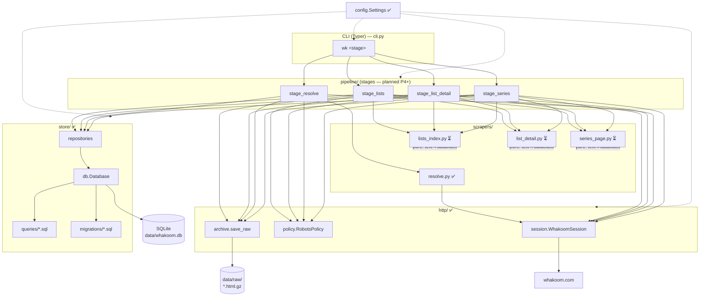
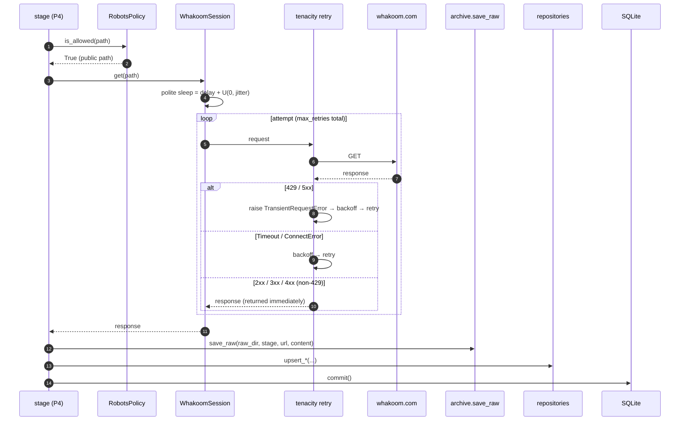
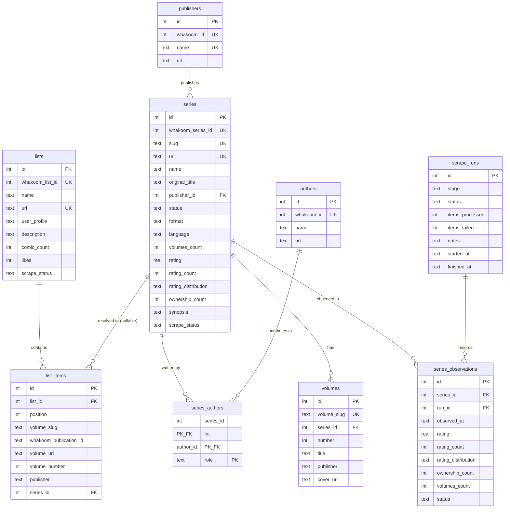
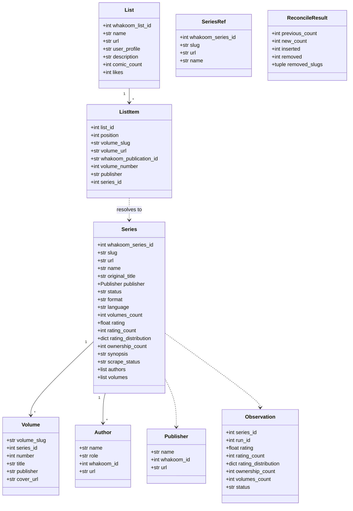
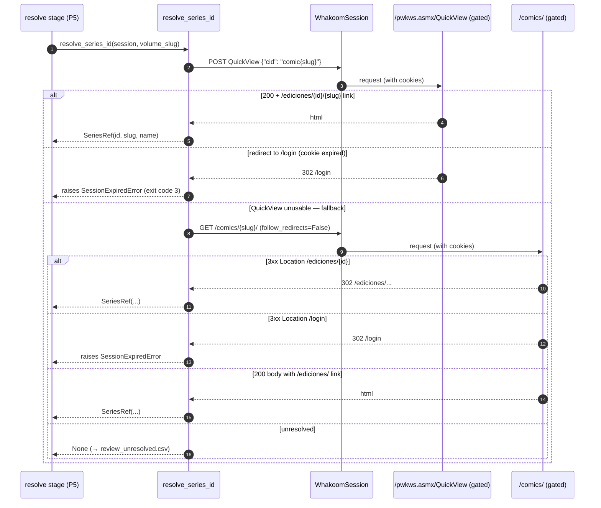
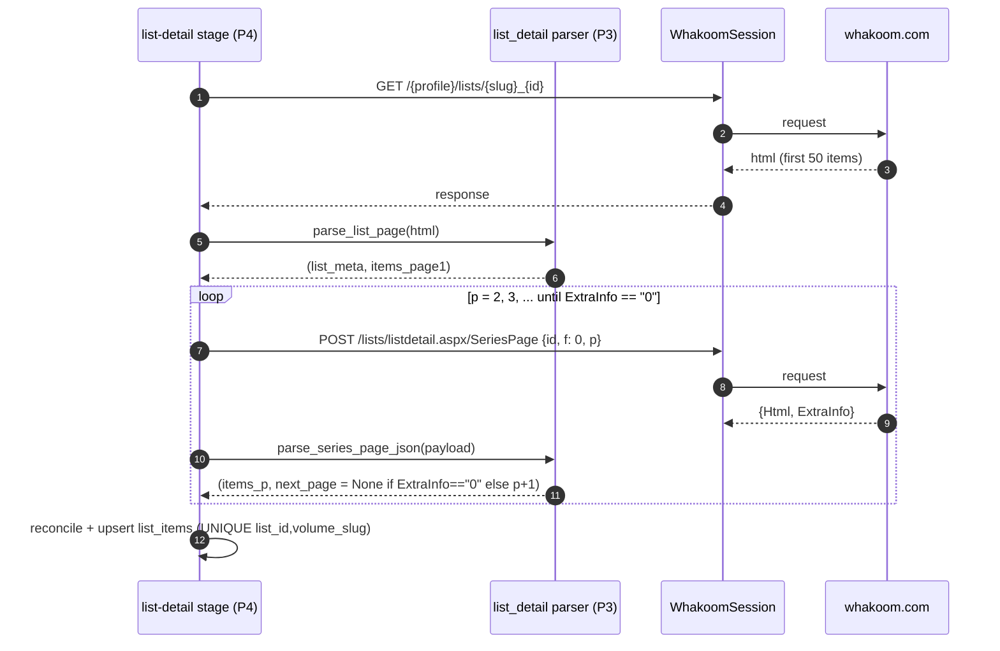
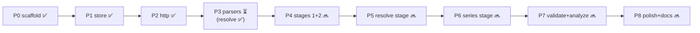

# Architecture (V2)

System overview of the V2 Whakoom scraper (`whakoom_scraper/`): a plain-Python, sync-first `httpx`
pipeline that extracts manga-collection data from curated Whakoom user lists into a local SQLite store.

> **Scope of this document.** It describes **what is built today** (P0 scaffold/config/CLI, P1 store, P2
> HTTP layer, and the `resolve` parser) plus **what is immediately next** (the three public parsers of
> Phase 3). Later phases are tracked in [`../phases.md`](../phases.md) and are intentionally not detailed
> here. See [`README.md`](README.md) for the build-status table.

## 1. High-level components

The system is layered: the CLI dispatches to pipeline **stages**, which orchestrate **scrapers** (pure
parsers + the I/O-bound resolver), an **HTTP layer**, and a **store**. Each layer depends only on the layer
below it; SQL never leaves the store, and I/O never leaves the HTTP layer / resolver.

```mermaid
graph TB
    subgraph CLI["CLI (Typer) — cli.py"]
        WK["wk &lt;stage&gt;"]
    end

    subgraph Pipeline["pipeline/ (stages — planned P4+)"]
        S1["stage_lists"]
        S2["stage_list_detail"]
        S3["stage_resolve"]
        S4["stage_series"]
    end

    subgraph Scrapers["scrapers/"]
        RS["resolve.py ✅"]
        PL["lists_index.py ⏳"]
        PD["list_detail.py ⏳"]
        PS["series_page.py ⏳"]
    end

    subgraph HTTP["http/ ✅"]
        SESS["session.WhakoomSession"]
        POL["policy.RobotsPolicy"]
        ARCH["archive.save_raw"]
    end

    subgraph Store["store/ ✅"]
        DB["db.Database"]
        REPO["repositories"]
        Q["queries/*.sql"]
        MIG["migrations/*.sql"]
    end

    DBFILE[("SQLite<br/>data/whakoom.db")]
    RAW[("data/raw/<br/>*.html.gz")]
    SITE["whakoom.com"]

    WK --> S1 & S2 & S3 & S4
    S1 & S2 & S4 --> PL & PD & PS
    S3 --> RS
    PL & PD & PS -. "pure: text→dataclass" .- Scrapers
    RS --> SESS
    S1 & S2 & S3 & S4 --> POL
    S1 & S2 & S3 & S4 --> SESS
    SESS --> SITE
    S1 & S2 & S3 & S4 --> ARCH
    ARCH --> RAW
    S1 & S2 & S3 & S4 --> REPO
    REPO --> DB
    DB --> Q
    DB --> MIG
    DB --> DBFILE

    CFG["config.Settings ✅"] -.-> WK & Pipeline & HTTP & Store
```

**Layers and their rules**

| Layer | Responsibility | Rule |
|---|---|---|
| `cli` | Parse args, dispatch to a stage, return exit code | No business logic |
| `pipeline` | Orchestrate one stage: robots → fetch → parse → persist | Owns the transaction boundary (commit) |
| `scrapers` | Pure parsers (text → dataclass) + the I/O resolver | No DB access; no SQL |
| `http` | One client, politeness, retry, robots, raw archive | No SQL; the only network boundary |
| `store` | SQLite, named queries, migrations, repositories | No network; the only SQL boundary |

## 2. Request lifecycle (public stage)

Every public request goes through robots, the polite+retrying session, the raw archive, and a repository
before the stage commits. The HTTP-side behavior (robots, politeness, retry, `TransientRequestError`) is
**built** (P2); the stage orchestration (archive write + repository + commit) is the **planned** P4 shape
and is shown here to illustrate how the built pieces compose.

```mermaid
sequenceDiagram
    autonumber
    participant Stage as stage (P4)
    participant R as RobotsPolicy
    participant W as WhakoomSession
    participant T as tenacity retry
    participant Net as whakoom.com
    participant A as archive.save_raw
    participant Repo as repositories
    participant DB as SQLite

    Stage->>R: is_allowed(path)
    R-->>Stage: True (public path)
    Stage->>W: get(path)
    W->>W: polite sleep = delay + U(0, jitter)
    loop attempt (max_retries total)
        W->>T: request
        T->>Net: GET
        Net-->>T: response
        alt 429 / 5xx
            T->>T: raise TransientRequestError → backoff → retry
        else Timeout / ConnectError
            T->>T: backoff → retry
        else 2xx / 3xx / 4xx (non-429)
            T-->>W: response (returned immediately)
        end
    end
    W-->>Stage: response
    Stage->>A: save_raw(raw_dir, stage, url, content)
    Stage->>Repo: upsert_*(...)
    Stage->>DB: commit()
```

> On retry exhaustion the session **raises** `TransientRequestError` (see
> [ADR-0006](adr/0006-http-retry-and-transient-error-contract.md)); the stage surfaces it as a loud failure
> rather than a silent 503.

## 3. Data model (database ERD)

Ten tables, defined forward-only in
[`001_initial_schema.sql`](../whakoom_scraper/store/migrations/001_initial_schema.sql). Surrogate `id`
primary keys never leave the store; external identifiers always carry the `whakoom_` prefix. Foreign keys
are enforced (`PRAGMA foreign_keys = ON`); `series_authors` is the series↔author junction.

```mermaid
erDiagram
    publishers ||--o{ series : "publishes"
    series ||--o{ volumes : "has"
    series ||--o{ series_observations : "observed in"
    series ||--o{ series_authors : "written by"
    authors ||--o{ series_authors : "contributes to"
    lists ||--o{ list_items : "contains"
    series ||--o{ list_items : "resolved to (nullable)"
    scrape_runs ||--o{ series_observations : "records"

    lists {
        int id PK
        int whakoom_list_id UK
        text name
        text url UK
        text user_profile
        text description
        int comic_count
        int likes
        text scrape_status
    }
    list_items {
        int id PK
        int list_id FK
        int position
        text volume_slug
        text whakoom_publication_id
        text volume_url
        int volume_number
        text publisher
        int series_id FK
    }
    series {
        int id PK
        int whakoom_series_id UK
        text slug UK
        text url UK
        text name
        text original_title
        int publisher_id FK
        text status
        text format
        text language
        int volumes_count
        real rating
        int rating_count
        text rating_distribution
        int ownership_count
        text synopsis
        text scrape_status
    }
    volumes {
        int id PK
        text volume_slug UK
        int series_id FK
        int number
        text title
        text publisher
        text cover_url
    }
    publishers {
        int id PK
        int whakoom_id UK
        text name UK
        text url
    }
    authors {
        int id PK
        int whakoom_id UK
        text name
        text url
    }
    series_authors {
        int series_id PK_FK
        int author_id PK_FK
        text role PK
    }
    series_observations {
        int id PK
        int series_id FK
        int run_id FK
        text observed_at
        real rating
        int rating_count
        text rating_distribution
        int ownership_count
        int volumes_count
        text status
    }
    scrape_runs {
        int id PK
        text stage
        text status
        int items_processed
        int items_failed
        text notes
        text started_at
        text finished_at
    }
```

Unique constraints of note: `lists.(whakoom_list_id)`, `lists.(url)`, `series.(whakoom_series_id)`,
`series.(slug)`, `series.(url)`, `volumes.(volume_slug)`, `list_items.(list_id, position)`,
`list_items.(list_id, volume_slug)`, `series_observations.(series_id, run_id)`. These enforce the
**deduplication hard rule** (AGENTS §6) at the database level.

## 4. Domain model (class diagram)

Domain dataclasses live in [`domain.py`](../whakoom_scraper/domain.py). All are `kw_only=True`. The scraper
output types (`SeriesRef`, `ReconcileResult`) are frozen. `Series` composes `Publisher`, a list of
`Author` (with role), and a list of `Volume`.

```mermaid
classDiagram
    class List {
        +int whakoom_list_id
        +str name
        +str url
        +str user_profile
        +str description
        +int comic_count
        +int likes
    }
    class ListItem {
        +int list_id
        +int position
        +str volume_slug
        +str volume_url
        +str whakoom_publication_id
        +int volume_number
        +str publisher
        +int series_id
    }
    class Series {
        +int whakoom_series_id
        +str slug
        +str url
        +str name
        +str original_title
        +Publisher publisher
        +str status
        +str format
        +str language
        +int volumes_count
        +float rating
        +int rating_count
        +dict rating_distribution
        +int ownership_count
        +str synopsis
        +str scrape_status
        +list authors
        +list volumes
    }
    class Volume {
        +str volume_slug
        +int series_id
        +int number
        +str title
        +str publisher
        +str cover_url
    }
    class Publisher {
        +str name
        +int whakoom_id
        +str url
    }
    class Author {
        +str name
        +str role
        +int whakoom_id
        +str url
    }
    class Observation {
        +int series_id
        +int run_id
        +float rating
        +int rating_count
        +dict rating_distribution
        +int ownership_count
        +int volumes_count
        +str status
    }
    class SeriesRef {
        +int whakoom_series_id
        +str slug
        +str url
        +str name
    }
    class ReconcileResult {
        +int previous_count
        +int new_count
        +int inserted
        +int removed
        +tuple removed_slugs
    }

    List "1" --> "*" ListItem
    ListItem ..> Series : resolves to
    Series "1" --> "*" Volume
    Series "1" --> "*" Author
    Series ..> Publisher
    Series ..> Observation
```

## 5. Gated series resolution (built — `resolve.py`)

List items expose only volume URLs (`/comics/{volume_slug}/...`); the numeric `whakoom_series_id` is only
published on gated pages. The resolver maps a volume slug to a `SeriesRef` using a logged-in session — the
**single gated step**, gated behind `WK_ALLOW_GATED_RESOLUTION=1` (see
[ADR-0002](adr/0002-cookie-backed-series-resolution.md)). This is already implemented in
[`scrapers/resolve.py`](../whakoom_scraper/scrapers/resolve.py).

```mermaid
sequenceDiagram
    autonumber
    participant Stage as resolve stage (P5)
    participant R as resolve_series_id
    participant W as WhakoomSession
    participant QV as /pwkws.asmx/QuickView (gated)
    participant V as /comics/ (gated)

    Stage->>R: resolve_series_id(session, volume_slug)
    R->>W: POST QuickView {"cid": "comic{slug}"}
    W->>QV: request (with cookies)
    alt 200 + /ediciones/{id}/{slug} link
        QV-->>R: html
        R-->>Stage: SeriesRef(id, slug, name)
    else redirect to /login (cookie expired)
        QV-->>R: 302 /login
        R-->>Stage: raises SessionExpiredError (exit code 3)
    else QuickView unusable — fallback
        R->>W: GET /comics/{slug}/ (follow_redirects=False)
        W->>V: request (with cookies)
        alt 3xx Location /ediciones/{id}
            V-->>R: 302 /ediciones/...
            R-->>Stage: SeriesRef(...)
        else 3xx Location /login
            V-->>R: 302 /login
            R-->>Stage: raises SessionExpiredError
        else 200 body with /ediciones/ link
            V-->>R: html
            R-->>Stage: SeriesRef(...)
        else unresolved
            R-->>Stage: None (→ review_unresolved.csv)
        end
    end
```

## 6. List-detail pagination (next — P3 parser + P4 stage)

This is the **immediately next** work for the parser layer. The first 50 list items are server-rendered;
further pages come from a JSON endpoint that terminates when `ExtraInfo == "0"`. The parsers
(`parse_list_page`, `parse_series_page_json`) are **pure functions** to be added in Phase 3; the stage
wiring is Phase 4.

```mermaid
sequenceDiagram
    autonumber
    participant Stage as list-detail stage (P4)
    participant P as list_detail parser (P3)
    participant W as WhakoomSession
    participant Site as whakoom.com

    Stage->>W: GET /{profile}/lists/{slug}_{id}
    W->>Site: request
    Site-->>W: html (first 50 items)
    W-->>Stage: response
    Stage->>P: parse_list_page(html)
    P-->>Stage: (list_meta, items_page1)
    loop p = 2, 3, ... until ExtraInfo == "0"
        Stage->>W: POST /lists/listdetail.aspx/SeriesPage {id, f: 0, p}
        W->>Site: request
        Site-->>W: {Html, ExtraInfo}
        Stage->>P: parse_series_page_json(payload)
        P-->>Stage: (items_p, next_page = None if ExtraInfo=="0" else p+1)
    end
    Stage->>Stage: reconcile + upsert list_items (UNIQUE list_id,volume_slug)
```

## 7. Phase progression

Strict phase dependencies (P0 → P8). Green = built; amber = in progress; grey = planned.

```mermaid
flowchart LR
    P0["P0 scaffold ✅"] --> P1["P1 store ✅"]
    P1 --> P2["P2 http ✅"]
    P2 --> P3["P3 parsers ⏳<br/>(resolve ✅)"]
    P3 --> P4["P4 stages 1+2 🔜"]
    P4 --> P5["P5 resolve stage 🔜"]
    P5 --> P6["P6 series stage 🔜"]
    P6 --> P7["P7 validate+analyze 🔜"]
    P7 --> P8["P8 polish+docs 🔜"]
```

Every phase passes the global gates (`uv run pytest`, `ruff`, `mypy`, `bandit`, `pre-commit`) before it is
marked done. See [`../phases.md`](../phases.md) for deliverables, validation gates, and per-phase "done
when" criteria.

## 8. Cross-cutting conventions

- **No raw SQL outside the store.** Stages call `repositories.*`; repositories call
  `Database.execute(file, name, params)`; SQL lives in `store/queries/*.sql` with `-- name:` markers and
  `?` placeholders only (AGENTS §5).
- **No network outside `http/`.** The single retrying client (`WhakoomSession`) is the network boundary;
  politeness + retry are centralized there (ADR-0006).
- **Bandit-clean by construction.** Non-security randomness uses `random.SystemRandom`; non-security
  hashing uses `hashlib.sha256` — no `# nosec` suppressions (ADR-0007, AGENTS §2).
- **Dedup is a hard rule.** Enforced by `UNIQUE` constraints + `ON CONFLICT` upserts at the DB level
  (AGENTS §6).
- **Errors are loud.** Session expiry aborts `resolve` with exit code 3; exhausted retries raise
  `TransientRequestError`; nothing fails silently (AGENTS §6).
