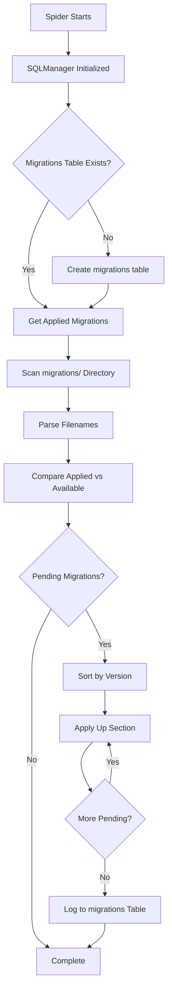

# Migrations Guide

How to work with the migration system for schema evolution.

---

## Overview

The project uses a **file-based migration system** with automatic application on spider startup.

### Features

- **Version tracking** - Each migration has a unique version number
- **Idempotent** - Migrations can be run multiple times safely
- **Up/Down sections** - Schema changes and rollback definitions
- **Automatic application** - Pending migrations applied on spider start
- **Manual support** - Can apply migrations manually if needed

---

## Migration File Format

### Naming Convention

**Pattern:** `XXX_description.sql`

- `XXX` = Three-digit version number (001, 002, 003...)
- `description` = Short, descriptive name (snake_case)

**Examples:**
- `001_initial_schema.sql`
- `002_add_volume_metadata.sql`
- `003_create_indexes.sql`

**Important:**
- Version numbers must be sequential (001, 002, 003...)
- Names should be unique
- All files must end with `.sql` extension

### File Structure

Each migration file contains two sections:

```sql
-- Up
CREATE TABLE lists (...);
CREATE TABLE titles (...);
-- ... more schema changes

-- Down
DROP TABLE IF EXISTS titles;
DROP TABLE IF EXISTS lists;
-- ... rollback changes
```

#### Up Section

Contains schema changes to apply:
- CREATE TABLE statements
- ALTER TABLE statements
- CREATE INDEX statements
- INSERT statements for default data

#### Down Section

Contains rollback steps:
- DROP TABLE statements
- DROP INDEX statements
- DELETE statements for cleanup

**Note:** Down sections are defined but rollback functionality is not yet implemented.

---

## Example Migration

### 001_initial_schema.sql

```sql
-- Up
CREATE TABLE IF NOT EXISTS lists (
    id INTEGER PRIMARY KEY AUTOINCREMENT,
    list_id INTEGER NOT NULL UNIQUE,
    title TEXT NOT NULL,
    url TEXT NOT NULL UNIQUE,
    user_profile TEXT NOT NULL,
    scrape_status TEXT NOT NULL DEFAULT 'pending',
    scraped_at TIMESTAMP,
    created_at TIMESTAMP DEFAULT CURRENT_TIMESTAMP,
    updated_at TIMESTAMP DEFAULT CURRENT_TIMESTAMP
);

CREATE TABLE IF NOT EXISTS titles (
    id INTEGER PRIMARY KEY AUTOINCREMENT,
    title_id INTEGER NOT NULL UNIQUE,
    title TEXT NOT NULL,
    url TEXT NOT NULL UNIQUE,
    scrape_status TEXT NOT NULL DEFAULT 'pending',
    scraped_at TIMESTAMP,
    created_at TIMESTAMP DEFAULT CURRENT_TIMESTAMP,
    updated_at TIMESTAMP DEFAULT CURRENT_TIMESTAMP
);

CREATE INDEX IF NOT EXISTS idx_lists_scrape_status ON lists (scrape_status);
CREATE INDEX IF NOT EXISTS idx_titles_scrape_status ON titles (scrape_status);

-- Down
DROP TABLE IF EXISTS scraping_log;
DROP TABLE IF EXISTS title_enriched;
DROP TABLE IF EXISTS title_metadata;
DROP TABLE IF EXISTS volumes;
DROP TABLE IF EXISTS lists_titles;
DROP TABLE IF EXISTS titles;
DROP TABLE IF EXISTS lists;
```

---

## How Migrations Work

### Automatic Application

On spider startup, `SQLManager` automatically:

1. **Checks migrations table** - Reads applied migration versions
2. **Scans migrations directory** - Finds all `*.sql` files
3. **Parses filenames** - Extracts version and name
4. **Identifies pending** - Compares applied vs available
5. **Applies in order** - Sorts by version, applies Up sections
6. **Tracks success** - Inserts version + name into migrations table

### Flow Diagram



---

## Creating a New Migration

### Step 1: Create Migration File

Create a new file in `whakoom_webscrapper/migrations/`:

```bash
cd whakoom_webscrapper/migrations
touch 002_add_new_field.sql
```

### Step 2: Write Up Section

Add schema changes:

```sql
-- Up
-- Add a new column to titles table
ALTER TABLE titles ADD COLUMN language TEXT;

-- Create an index on the new column
CREATE INDEX IF NOT EXISTS idx_titles_language ON titles (language);
```

### Step 3: Write Down Section

Add rollback steps:

```sql
-- Down
-- Remove the index
DROP INDEX IF EXISTS idx_titles_language;

-- Remove the column
-- Note: SQLite doesn't support DROP COLUMN directly
-- This would require recreating the table
```

**SQLite Limitation:** SQLite doesn't support `DROP COLUMN` directly. For removing columns, you need to:
1. Create new table without the column
2. Copy data from old table
3. Drop old table
4. Rename new table

### Step 4: Apply Migration

Run any spider to trigger automatic migration application:

```bash
uv run scrapy crawl lists
```

Or manually check:

```bash
sqlite3 databases/publications.db "SELECT * FROM migrations;"
```

---

## Best Practices

### 1. Use IF NOT EXISTS

Always make migrations idempotent:

```sql
-- Good
CREATE TABLE IF NOT EXISTS titles (...);

-- Bad
CREATE TABLE titles (...);  -- Fails if table exists
```

### 2. Use IF EXISTS for Indexes

```sql
-- Good
CREATE INDEX IF NOT EXISTS idx_titles_status ON titles (scrape_status);

-- Bad
CREATE INDEX idx_titles_status ON titles (scrape_status);  -- Fails if exists
```

### 3. Version Numbers

- Use sequential numbers: 001, 002, 003...
- Don't skip numbers
- Pad with leading zeros for sorting

### 4. Descriptive Names

- Use snake_case
- Be specific about what changes
- Include table names if applicable

```sql
001_initial_schema.sql              -- Good
001_schema.sql                     -- Okay
001_create_everything.sql           -- Too vague
002_add_language_to_titles.sql    -- Good
003_update.sql                    -- Too vague
```

### 5. Down Sections

- Include rollback steps even if not implemented
- Follow reverse order of Up section
- Document SQLite limitations

### 6. Test Migrations

- Test on fresh database (no migrations table)
- Test on existing database (previous migrations applied)
- Verify data integrity after migration
- Check constraints and indexes

---

## Common Patterns

### Adding a Column

```sql
-- Up
ALTER TABLE titles ADD COLUMN new_column TEXT;

-- Down
-- SQLite requires table recreation
CREATE TABLE titles_new (
    id INTEGER PRIMARY KEY AUTOINCREMENT,
    title_id INTEGER NOT NULL UNIQUE,
    title TEXT NOT NULL,
    -- ... other columns without new_column
);
INSERT INTO titles_new SELECT id, title_id, title, ... FROM titles;
DROP TABLE titles;
ALTER TABLE titles_new RENAME TO titles;
```

### Creating a New Table

```sql
-- Up
CREATE TABLE IF NOT EXISTS new_table (
    id INTEGER PRIMARY KEY AUTOINCREMENT,
    name TEXT NOT NULL,
    created_at TIMESTAMP DEFAULT CURRENT_TIMESTAMP
);

-- Down
DROP TABLE IF EXISTS new_table;
```

### Adding Foreign Key

```sql
-- Up
ALTER TABLE volumes ADD CONSTRAINT fk_title_id
FOREIGN KEY (title_id) REFERENCES titles(id) ON DELETE CASCADE;

-- Note: SQLite doesn't support ADD CONSTRAINT directly
-- This would require table recreation
```

### Creating an Index

```sql
-- Up
CREATE INDEX IF NOT EXISTS idx_table_column ON table (column);

-- Down
DROP INDEX IF EXISTS idx_table_column;
```

### Adding Default Data

```sql
-- Up
INSERT OR IGNORE INTO lists (list_id, title, url, user_profile)
VALUES (0, 'Uncategorized', 'https://...', 'system');

-- Down
DELETE FROM lists WHERE list_id = 0;
```

---

## Checking Migration Status

### View Applied Migrations

```bash
sqlite3 databases/publications.db "SELECT version, name, applied_at FROM migrations ORDER BY version;"
```

**Output:**
```
001|initial_schema|2026-02-01 18:00:00
002|add_language_to_titles|2026-02-01 19:00:00
```

### View Pending Migrations

Pending migrations are those in `migrations/` directory but not in database.

Compare:

```bash
# List migration files
ls -1 whakoom_webscrapper/migrations/*.sql

# Check database
sqlite3 databases/publications.db "SELECT version FROM migrations;"
```

### Manual Migration Check

Use SQLManager to check:

```python
from whakoom_webscrapper.sqlmanager import SQLManager

sql_manager = SQLManager(
    db_path="databases/publications.db",
    migrations_dir="whakoom_webscrapper/migrations"
)

pending = sql_manager.get_pending_migrations()
print(f"Pending migrations: {pending}")
```

---

## Manual Migration Application

While migrations are applied automatically, you can manually apply them if needed:

### Using SQLManager

```python
from whakoom_webscrapper.sqlmanager import SQLManager

sql_manager = SQLManager(
    db_path="databases/publications.db",
    migrations_dir="whakoom_webscrapper/migrations"
)

# Apply all pending migrations
sql_manager.apply_migrations()
```

### Using SQLite CLI

For one-off migrations during development:

```bash
sqlite3 databases/publications.db <<EOF
-- Paste Up section here
CREATE TABLE IF NOT EXISTS new_table (...);
EOF
```

**Warning:** Manual application doesn't track in migrations table. Only use for development/testing.

---

## Troubleshooting

### Migration Fails to Apply

**Symptom:** Migration runs but errors occur.

**Possible Causes:**
1. SQL syntax error
2. Constraint violation
3. File encoding issue

**Solutions:**

1. **Check SQL syntax:**
   ```bash
   sqlite3 databases/publications.db < migration_file.sql
   ```

2. **View error logs:**
   ```bash
   uv run scrapy crawl lists --loglevel=DEBUG
   ```

3. **Check migrations table:**
   ```bash
   sqlite3 databases/publications.db "SELECT * FROM migrations;"
   ```

### Migration Applied Partially

**Symptom:** Some tables created, others not.

**Cause:** Migration stopped mid-way due to error.

**Solution:**
1. Check which tables/indexes exist
2. Manually complete the migration
3. Remove migration from migrations table (delete record)
4. Re-run migration

### Duplicate Migration

**Symptom:** `RuntimeError: Migration 002 failed: UNIQUE constraint failed`

**Cause:** Migration version already in migrations table.

**Solution:**
```bash
# Remove from migrations table
sqlite3 databases/publications.db "DELETE FROM migrations WHERE version='002';"

# Re-apply migration
uv run scrapy crawl lists
```

### Migration Not Detected

**Symptom:** Migration in directory but not applied.

**Cause:**
1. Filename format incorrect
2. File not in correct directory
3. File encoding issue

**Solution:**
1. Verify filename format: `XXX_description.sql`
2. Check file location: `whakoom_webscrapper/migrations/`
3. Check file encoding: UTF-8

---

## Rollback Support

**Status:** Down sections are defined but rollback is not yet implemented.

### Future Implementation

Planned rollback functionality would:

1. Allow specifying a target version to rollback to
2. Execute Down sections in reverse order
3. Track rollback in migrations table

**Example (Future):**
```python
# Rollback to version 001 (undo 002, 003, etc.)
sql_manager.rollback_to_version("001")
```

---

## Related Documentation

- [Database Schema](schema.md) - Complete schema documentation
- [SQLManager Guide](sqlmanager-guide.md) - SQLManager usage
- [Architecture](../architecture.md) - System architecture overview
