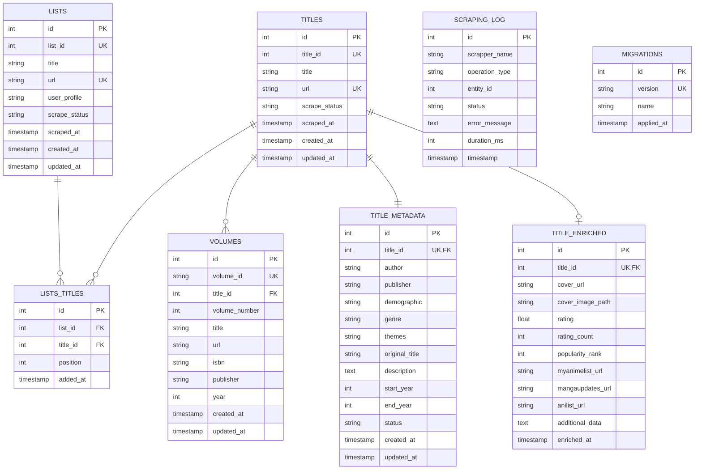
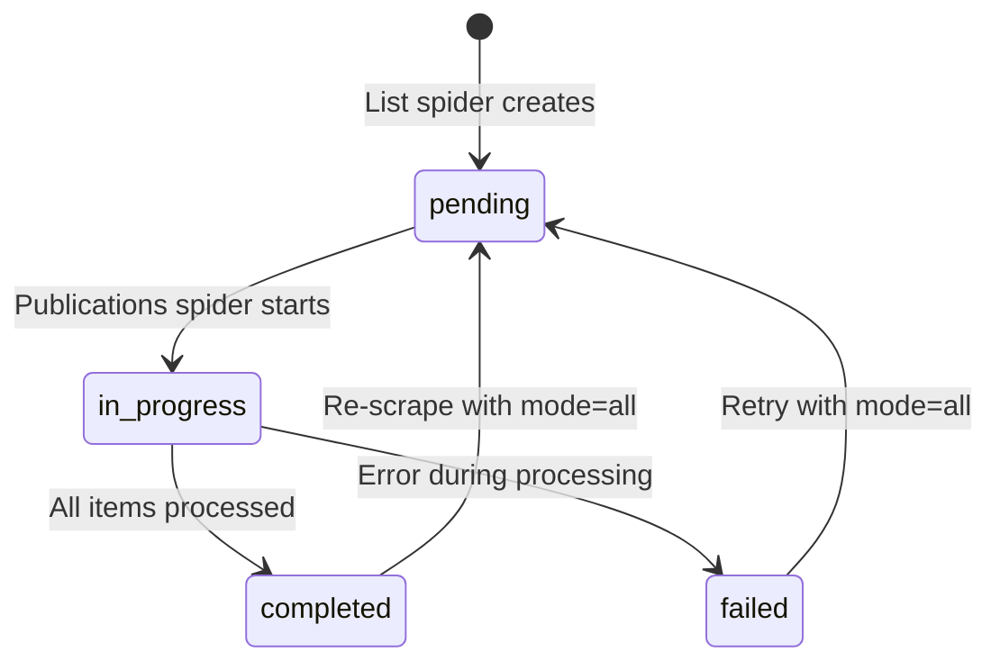
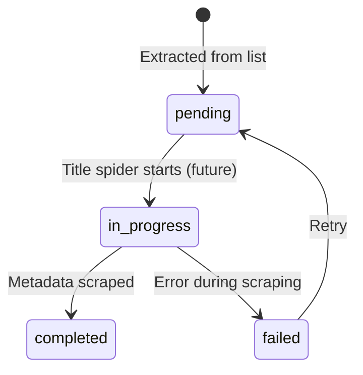

# Database Schema

Complete database schema documentation with detailed table descriptions, relationships, and constraints.

---

## Overview

The database uses **SQLite** with a relational schema designed to support:

- Tracking scraping progress per entity (lists, titles, volumes)
- Many-to-many relationships (titles ↔ lists)
- Metadata storage (title information, enrichment data)
- Complete audit trail (timestamps, status transitions)
- Migration support (schema evolution over time)

---

## Entity Relationship Diagram



---

## Tables

### lists

Stores scraped lists from Whakoom user profiles.

**Purpose:** Track all user-defined lists and their scraping status.

| Column | Type | Constraints | Description |
|--------|------|-------------|-------------|
| id | INTEGER | PRIMARY KEY AUTOINCREMENT | Internal database ID |
| list_id | INTEGER | UNIQUE, NOT NULL | Whakoom's internal list ID |
| title | TEXT | NOT NULL | List title/name |
| url | TEXT | UNIQUE, NOT NULL | Full list URL |
| user_profile | TEXT | NOT NULL | Whakoom username (owner of list) |
| scrape_status | TEXT | NOT NULL | Status: `pending` \| `in_progress` \| `completed` \| `failed` |
| scraped_at | TIMESTAMP | NULL | When list was scraped |
| created_at | TIMESTAMP | DEFAULT CURRENT_TIMESTAMP | Record creation time |
| updated_at | TIMESTAMP | DEFAULT CURRENT_TIMESTAMP | Last update time |

**Indexes:**
- `idx_lists_scrape_status` on `(scrape_status)`
- `idx_lists_user_profile` on `(user_profile)`

**Status Values:**
- `pending` - List found, not yet processed
- `in_progress` - Currently being processed by publications spider
- `completed` - Successfully processed all items in list
- `failed` - Error occurred during processing

**Example Data:**
```sql
INSERT INTO lists (list_id, title, url, user_profile, scrape_status)
VALUES (131178, 'Licencias Manga en Español 2025',
        'https://www.whakoom.com/deirdre/lists/licencias_manga_en_espana_2025_131178',
        'deirdre', 'completed');
```

---

### titles

Stores unique manga titles (deduplicated across all lists).

**Purpose:** Track each manga series once, regardless of how many lists it appears in.

| Column | Type | Constraints | Description |
|--------|------|-------------|-------------|
| id | INTEGER | PRIMARY KEY AUTOINCREMENT | Internal database ID |
| title_id | INTEGER | UNIQUE, NOT NULL | Whakoom's internal title ID (numeric) |
| title | TEXT | NOT NULL | Title name |
| url | TEXT | UNIQUE, NOT NULL | Full Title URL |
| scrape_status | TEXT | NOT NULL | Status: `pending` \| `in_progress` \| `completed` \| `failed` |
| scraped_at | TIMESTAMP | NULL | When title metadata was scraped |
| created_at | TIMESTAMP | DEFAULT CURRENT_TIMESTAMP | Record creation time |
| updated_at | TIMESTAMP | DEFAULT CURRENT_TIMESTAMP | Last update time |

**Indexes:**
- `idx_titles_scrape_status` on `(scrape_status)`
- `idx_titles_title_id` on `(title_id)`

**Status Values:**
- `pending` - Title extracted from list, metadata not yet scraped
- `in_progress` - Currently being processed by title spider (future)
- `completed` - Metadata successfully scraped
- `failed` - Error occurred during metadata scraping

**Deduplication:**
- `UNIQUE (title_id)` ensures same title (same `title_id`) appears only once
- Same title appearing in multiple lists results in one `titles` entry
- Multiple `lists_titles` entries link title to different lists

**Example Data:**
```sql
INSERT INTO titles (title_id, title, url, scrape_status)
VALUES (673392, 'Rosen Blood',
        'https://www.whakoom.com/ediciones/673392/rosen_blood', 'pending');
```

---

### volumes

Stores individual volumes/issues belonging to titles.

**Purpose:** Track each physical/digital release of a title.

| Column | Type | Constraints | Description |
|--------|------|-------------|-------------|
| id | INTEGER | PRIMARY KEY AUTOINCREMENT | Internal database ID |
| volume_id | TEXT | UNIQUE, NOT NULL | Whakoom's volume ID (alphanumeric, e.g., 'fxTr6') |
| title_id | INTEGER | NOT NULL, FOREIGN KEY | FK to `titles.id` - Parent title |
| volume_number | INTEGER | NULL | Volume number in sequence (ignored for now) |
| title | TEXT | NULL | Volume title/name (ignored for now) |
| url | TEXT | NULL | Volume page URL |
| isbn | TEXT | NULL | ISBN code (ignored for now) |
| publisher | TEXT | NULL | Publisher of this volume (ignored for now) |
| year | INTEGER | NULL | Publication year (ignored for now) |
| created_at | TIMESTAMP | DEFAULT CURRENT_TIMESTAMP | Record creation time |
| updated_at | TIMESTAMP | DEFAULT CURRENT_TIMESTAMP | Last update time |

**Indexes:**
- `idx_volumes_title` on `(title_id)`
- `idx_volumes_volume_id` on `(volume_id)`

**Foreign Key:**
- `title_id` → `titles.id` on DELETE CASCADE

**Note:** For the current implementation, only `volume_id`, `title_id`, and `url` are populated. Other fields will be populated in a future volume rework.

**Example Data:**
```sql
INSERT INTO volumes (volume_id, title_id, url)
VALUES ('fxTr6', 673392,
        'https://www.whakoom.com/comics/fxTr6/rosen_blood/1');
```

---

### lists_titles

Many-to-many junction table linking lists and titles.

**Purpose:** Track which titles appear in which lists, preserving multiplicity.

| Column | Type | Constraints | Description |
|--------|------|-------------|-------------|
| id | INTEGER | PRIMARY KEY AUTOINCREMENT | Internal database ID |
| list_id | INTEGER | NOT NULL, FOREIGN KEY | FK to `lists.id` |
| title_id | INTEGER | NOT NULL, FOREIGN KEY | FK to `titles.title_id` |
| position | INTEGER | NULL | Position of title within list |
| added_at | TIMESTAMP | DEFAULT CURRENT_TIMESTAMP | When relationship was added |

**Indexes:**
- `idx_lists_titles_list` on `(list_id)`
- `idx_lists_titles_title` on `(title_id)`

**Unique Constraint:**
- `(list_id, title_id)` - Prevents duplicate list-title relationships

**Foreign Keys:**
- `list_id` → `lists.id` on DELETE CASCADE
- `title_id` → `titles.id` on DELETE CASCADE

**Note:** `list_id` refers to database `lists.id` (primary key), NOT the Whakoom `list_id`.

**Example Data:**
```sql
INSERT INTO lists_titles (list_id, title_id, position)
VALUES (123, 673392, 1);
```

---

### title_metadata

Stores detailed metadata for each title.

**Purpose:** Rich information about manga titles (author, publisher, description, etc.).

| Column | Type | Constraints | Description |
|--------|------|-------------|-------------|
| id | INTEGER | PRIMARY KEY AUTOINCREMENT | Internal database ID |
| title_id | INTEGER | UNIQUE, NOT NULL, FOREIGN KEY | FK to `titles.id` - Parent title |
| author | TEXT | NULL | Author name |
| publisher | TEXT | NULL | Publisher name |
| demographic | TEXT | NULL | Demographic (Shonen, Shojo, etc.) |
| genre | TEXT | NULL | Primary genre |
| themes | TEXT | NULL | Comma-separated themes |
| original_title | TEXT | NULL | Original title (if different) |
| description | TEXT | NULL | Synopsis/description |
| start_year | INTEGER | NULL | First publication year |
| end_year | INTEGER | NULL | Last publication year (NULL if ongoing) |
| status | TEXT | NULL | Publication status (Ongoing, Completed, etc.) |
| created_at | TIMESTAMP | DEFAULT CURRENT_TIMESTAMP | Record creation time |
| updated_at | TIMESTAMP | DEFAULT CURRENT_TIMESTAMP | Last update time |

**Foreign Key:**
- `title_id` → `titles.id` on DELETE CASCADE

**Note:** This table is populated by the future `TitleSpider`.

**Example Data:**
```sql
INSERT INTO title_metadata (title_id, author, publisher, demographic, genre, description, start_year, status)
VALUES (673392, 'Kureishi', 'Panini Manga', 'Shojo', 'Fantasy',
        'Chloe lives in a world where vampires are real...', 2018, 'Completed');
```

---

### title_enriched

Stores enriched data from external sources (MyAnimeList, MangaUpdates, etc.).

**Purpose:** External API data for titles (ratings, covers, cross-references).

| Column | Type | Constraints | Description |
|--------|------|-------------|-------------|
| id | INTEGER | PRIMARY KEY AUTOINCREMENT | Internal database ID |
| title_id | INTEGER | UNIQUE, NOT NULL, FOREIGN KEY | FK to `titles.id` - Parent title |
| cover_url | TEXT | NULL | URL to cover image |
| cover_image_path | TEXT | NULL | Local path to downloaded cover image |
| rating | REAL | NULL | Average rating score |
| rating_count | INTEGER | NULL | Number of ratings |
| popularity_rank | INTEGER | NULL | Popularity ranking |
| myanimelist_url | TEXT | NULL | MyAnimeList URL |
| mangaupdates_url | TEXT | NULL | MangaUpdates URL |
| anilist_url | TEXT | NULL | AniList URL |
| additional_data | TEXT | NULL | JSON string for additional data |
| enriched_at | TIMESTAMP | DEFAULT CURRENT_TIMESTAMP | When data was enriched |

**Foreign Key:**
- `title_id` → `titles.id` on DELETE CASCADE

**Note:** All fields are optional. This table supports future enrichment work.

**Example Data:**
```sql
INSERT INTO title_enriched (title_id, cover_url, rating, rating_count, popularity_rank, myanimelist_url)
VALUES (673392, 'https://cdn.myanimelist.net/images/...', 7.5, 1234, 456,
        'https://myanimelist.net/manga/...');
```

---

### scraping_log

Tracks all scraping operations for auditing and debugging.

**Purpose:** Complete audit trail of all scraping activities.

| Column | Type | Constraints | Description |
|--------|------|-------------|-------------|
| id | INTEGER | PRIMARY KEY AUTOINCREMENT | Internal database ID |
| scrapper_name | TEXT | NOT NULL | Name of spider (e.g., 'lists', 'publications') |
| operation_type | TEXT | NOT NULL | Type of operation (e.g., 'list_processing', 'title_processing') |
| entity_id | INTEGER | NOT NULL | ID of entity being processed |
| status | TEXT | NOT NULL | Operation status: `started` \| `success` \| `failed` |
| error_message | TEXT | NULL | Error message if failed |
| duration_ms | INTEGER | NULL | Duration in milliseconds |
| timestamp | TIMESTAMP | DEFAULT CURRENT_TIMESTAMP | When operation occurred |

**Indexes:**
- `idx_scraping_log_entity` on `(entity_id, operation_type)`

**Status Values:**
- `started` - Operation began
- `success` - Operation completed successfully
- `failed` - Operation failed

**Example Data:**
```sql
INSERT INTO scraping_log (scrapper_name, operation_type, entity_id, status)
VALUES ('lists', 'list_processing', 131178, 'started');
```

---

### migrations

Tracks applied database migrations.

**Purpose:** Schema evolution tracking - which migrations have been applied.

| Column | Type | Constraints | Description |
|--------|------|-------------|-------------|
| id | INTEGER | PRIMARY KEY AUTOINCREMENT | Internal database ID |
| version | TEXT | UNIQUE, NOT NULL | Migration version (e.g., '001') |
| name | TEXT | NOT NULL | Migration name (e.g., 'initial_schema') |
| applied_at | TIMESTAMP | DEFAULT CURRENT_TIMESTAMP | When migration was applied |

**Example Data:**
```sql
INSERT INTO migrations (version, name)
VALUES ('001', 'initial_schema');
```

---

## Relationships

### One-to-Many: Lists → ListsTitles

A list can contain multiple titles.

```mermaid
ERDiagram
    LISTS ||--o{ LISTS_TITLES : "contains"
```

**SQL Representation:**
```sql
-- One list
SELECT * FROM lists WHERE id = 123;

-- Multiple titles in list
SELECT * FROM lists_titles WHERE list_id = 123;
```

### One-to-Many: Titles → ListsTitles

A title can appear in multiple lists.

```mermaid
ERDiagram
    TITLES ||--o{ LISTS_TITLES : "appears in"
```

**SQL Representation:**
```sql
-- One title
SELECT * FROM titles WHERE title_id = 673392;

-- Multiple lists containing title
SELECT lt.*, l.title
FROM lists_titles lt
JOIN lists l ON lt.list_id = l.id
WHERE lt.title_id = 673392;
```

### One-to-Many: Titles → Volumes

A title can have multiple volumes.

```mermaid
ERDiagram
    TITLES ||--o{ VOLUMES : "has"
```

**SQL Representation:**
```sql
-- One title
SELECT * FROM titles WHERE title_id = 673392;

-- Multiple volumes for title
SELECT * FROM volumes WHERE title_id = 673392;
```

### One-to-One: Titles → TitleMetadata

A title has one metadata record.

```mermaid
ERDiagram
    TITLES ||--|| TITLE_METADATA : "has"
```

**SQL Representation:**
```sql
-- Title with metadata
SELECT t.*, tm.author, tm.publisher, tm.genre
FROM titles t
LEFT JOIN title_metadata tm ON t.id = tm.title_id
WHERE t.title_id = 673392;
```

### One-to-Zero-or-One: Titles → TitleEnriched

A title may have enriched data (optional).

```mermaid
ERDiagram
    TITLES ||--o| TITLE_ENRICHED : "may have"
```

**SQL Representation:**
```sql
-- Title with enriched data (if exists)
SELECT t.*, te.rating, te.myanimelist_url
FROM titles t
LEFT JOIN title_enriched te ON t.id = te.title_id
WHERE t.title_id = 673392;
```

---

## Status Transitions

### List Status Flow



### Title Status Flow



---

## Common Queries

### Get All Lists for a User

```sql
SELECT * FROM lists WHERE user_profile = 'deirdre';
```

### Get All Titles in a List

```sql
SELECT t.title_id, t.title, t.url, lt.position
FROM lists_titles lt
JOIN titles t ON lt.title_id = t.title_id
JOIN lists l ON lt.list_id = l.id
WHERE l.list_id = 131178
ORDER BY lt.position;
```

### Get All Volumes for a Title

```sql
SELECT * FROM volumes WHERE title_id = 673392 ORDER BY volume_number;
```

### Check for Duplicate Titles

```sql
-- Count how many lists each title appears in
SELECT title_id, t.title, COUNT(*) as list_count
FROM lists_titles lt
JOIN titles t ON lt.title_id = t.title_id
GROUP BY title_id
HAVING list_count > 1;
```

### Get Scraping Progress

```sql
-- Lists
SELECT scrape_status, COUNT(*) as count FROM lists GROUP BY scrape_status;

-- Titles
SELECT scrape_status, COUNT(*) as count FROM titles GROUP BY scrape_status;

-- Combined
SELECT
    (SELECT COUNT(*) FROM lists WHERE scrape_status='pending') as lists_pending,
    (SELECT COUNT(*) FROM lists WHERE scrape_status='completed') as lists_completed,
    (SELECT COUNT(*) FROM titles WHERE scrape_status='pending') as titles_pending,
    (SELECT COUNT(*) FROM titles WHERE scrape_status='completed') as titles_completed;
```

### Get Recent Scraping Activity

```sql
SELECT * FROM scraping_log
ORDER BY timestamp DESC
LIMIT 20;
```

### Get Failed Operations

```sql
SELECT * FROM scraping_log
WHERE status = 'failed'
ORDER BY timestamp DESC;
```

---

## Integrity Constraints

### Unique Constraints

| Table | Constraint | Purpose |
|--------|-------------|---------|
| lists | (list_id) | Prevent duplicate Whakoom list IDs |
| lists | (url) | Prevent duplicate list URLs |
| titles | (title_id) | Prevent duplicate title IDs (deduplication) |
| titles | (url) | Prevent duplicate title URLs |
| volumes | (volume_id) | Prevent duplicate volume IDs |
| lists_titles | (list_id, title_id) | Prevent duplicate list-title relationships |
| title_metadata | (title_id) | One metadata record per title |
| title_enriched | (title_id) | One enriched record per title |
| migrations | (version) | One migration per version |

### Foreign Key Constraints

| Table | Foreign Key | References | On Delete |
|--------|--------------|-------------|------------|
| volumes | title_id | titles.id | CASCADE |
| lists_titles | list_id | lists.id | CASCADE |
| lists_titles | title_id | titles.id | CASCADE |
| title_metadata | title_id | titles.id | CASCADE |
| title_enriched | title_id | titles.id | CASCADE |

**Cascade Delete Meaning:**
- When a title is deleted, all its volumes, metadata, and enriched data are automatically deleted
- When a list is deleted, all its list-title relationships are automatically deleted

---

## Related Documentation

- [Migrations Guide](migrations-guide.md) - Working with migrations
- [SQLManager Guide](sqlmanager-guide.md) - SQLManager usage
- [Queries Reference](queries-reference.md) - Named queries reference
- [Scraping Workflows](../workflows/) - How data flows through the database
