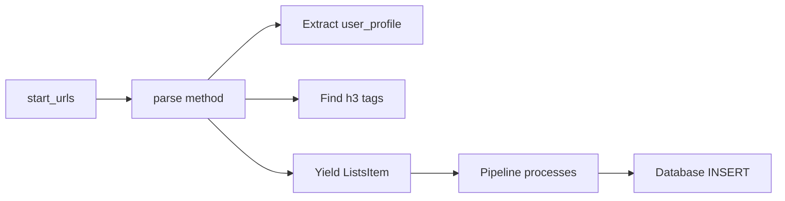
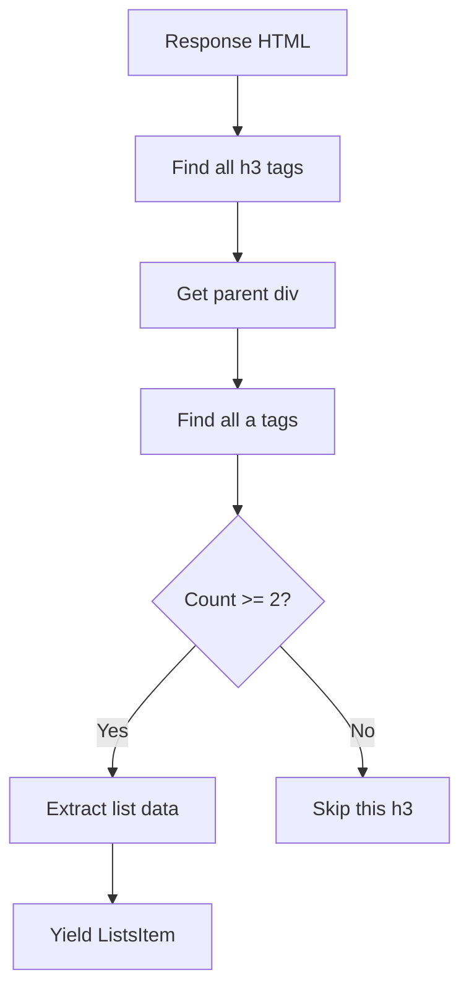

# List Spider Workflow

Detailed workflow for the `ListSpider` that scrapes user lists from Whakoom.

---

## Overview

**Spider:** `ListSpider`
**File:** `whakoom_webscrapper/spiders/lists.py`
**Purpose:** Scrape all lists from a Whakoom user profile
**Input:** User profile URL (e.g., `https://www.whakoom.com/deirdre/lists/`)
**Output:** `ListsItem` instances
**Database Target:** `lists` table
**Selenium:** No (uses Scrapy only)

---

## Spider Configuration

```python
class ListSpider(Spider):
    name = "lists"
    allowed_domains = ["whakoom.com"]
    start_urls = ["https://www.whakoom.com/deirdre/lists/"]
```

### Command Line Options

```bash
# Scrape default user (deirdre)
uv run scrapy crawl lists

# Export to JSON for inspection
uv run scrapy crawl lists -o lists.json

# Enable debug logging
uv run scrapy crawl lists --loglevel=DEBUG
```

---

## Entry Point

### `start_requests()` Method

Scrapy automatically calls `parse()` for each URL in `start_urls`.

**Flow:**


---

## URL Parsing

### Extracting User Profile

The spider extracts the `user_profile` from the URL path:

```python
def parse(self, response: Response) -> Iterator[ListsItem]:
    parsed_url = urlparse(response.url)
    user_profile = parsed_url.path.split("/")[1] if parsed_url.path else ""
    self.logger.info("Scraping lists for user profile: %s", user_profile)
```

**Example:**
```
URL: https://www.whakoom.com/deirdre/lists/
Extracted: user_profile = 'deirdre'
```

---

## List Extraction

### Finding Lists

The spider looks for HTML structure:



### XPath Expressions

```python
h3_tags = response.css("h3")

for h3 in h3_tags:
    parent_div = h3.xpath("parent::node()")
    following_a_tags = parent_div.xpath(".//a")

    if len(following_a_tags) > 1:
        list_title = following_a_tags[1].xpath("string()").extract_first().strip()
        list_id = int(following_a_tags[1].attrib["href"].rsplit("_", 1)[-1])
```

### HTML Structure Example

**Input HTML:**
```html
<div>
  <h3>Recent Lists</h3>
  <div>
    <a href="/deirdre">View profile</a>
    <a href="/deirdre/lists/licencias_manga_en_espana_2025_131178">
      Licencias Manga en Español 2025
    </a>
  </div>
</div>
```

**Extraction Logic:**
1. Find `<h3>` tag: "Recent Lists"
2. Get parent `<div>`
3. Find all `<a>` tags (2 links found)
4. Use second `<a>` tag (index 1):
   - `href` = `/deirdre/lists/licencias_manga_en_espana_2025_131178`
   - Text = "Licencias Manga en Español 2025"
5. Parse `list_id` from URL: `131178`
6. Store `list_title`: "Licencias Manga en Español 2025"

---

## Item Creation

### ListsItem Structure

```python
@dataclass(kw_only=True)
class ListsItem:
    list_id: int
    title: str
    url: str
    user_profile: str
    scrape_status: str = "pending"
    scraped_at: str | None = None

    table_name: str = "lists"
```

### Yielding Items

```python
yield ListsItem(
    list_id=list_id,
    title=list_title,
    url=following_a_tags[1].attrib["href"],
    user_profile=user_profile,
    scrape_status="pending",
)
```

**Example Item:**
```python
ListsItem(
    list_id=131178,
    title="Licencias Manga en Español 2025",
    url="https://www.whakoom.com/deirdre/lists/licencias_manga_en_espana_2025_131178",
    user_profile="deirdre",
    scrape_status="pending"
)
```

---

## Pipeline Processing

### Pipeline Stage 1: Item Received

**Pipeline Method:** `process_item()`

```python
def process_item(self, item: ListsItem, spider: Spider) -> None:
    if isinstance(item, ListsItem):
        self._process_lists_item(item, spider)
```

### Pipeline Stage 2: Log Operation Start

```python
def _process_lists_item(self, item: ListsItem, spider: Spider) -> None:
    logging.info("Processing list: %s (list_id: %s)", item.title, item.list_id)

    self.sql_manager.log_scraping_operation(
        scrapper_name=spider.name,
        operation_type="list_processing",
        entity_id=item.list_id,
        status="started",
    )
```

**Log Entry in `scraping_log` table:**
```
id: 1
scrapper_name: "lists"
operation_type: "list_processing"
entity_id: 131178
status: "started"
timestamp: 2026-02-01 18:00:00
```

### Pipeline Stage 3: Database Insert

```python
self.sql_manager.insert(ListsItem, item)
```

**SQL Generated:**
```sql
INSERT INTO lists (list_id, title, url, user_profile, scrape_status, scraped_at)
VALUES (?, ?, ?, ?, ?, ?)
```

**Parameters:**
```python
(131178, "Licencias Manga en Español 2025",
 "https://www.whakoom.com/deirdre/lists/...", "deirdre",
 "pending", None)
```

### Pipeline Stage 4: Log Success

```python
self.sql_manager.log_scraping_operation(
    scrapper_name=spider.name,
    operation_type="list_processing",
    entity_id=item.list_id,
    status="success",
)
```

**Log Entry in `scraping_log` table:**
```
id: 2
scrapper_name: "lists"
operation_type: "list_processing"
entity_id: 131178
status: "success"
timestamp: 2026-02-01 18:00:01
```

---

## Spider Completion

### Pipeline Cleanup

**Pipeline Method:** `close_spider()`

```python
def close_spider(self, spider: Spider) -> None:
    self.sql_manager.log_scraping_operation(
        scrapper_name=spider.name,
        operation_type="spider_finished",
        entity_id=0,
        status="success",
    )

    for list_id in self.processed_list_ids:
        self.sql_manager.update_single_field(
            "lists", "list_id", list_id, "scrape_status", "completed"
        )
```

**Note:** For ListSpider, lists are already created with `scrape_status="pending"`. The status update to `'completed'` is typically done by the publications spider when processing is complete.

---

## Complete Execution Example

### Command
```bash
uv run scrapy crawl lists
```

### Console Output
```
2026-02-01 18:00:00 [INFO] Scraping lists for user profile: deirdre
2026-02-01 18:00:01 [INFO] Processing list: Licencias Manga en Español 2025 (list_id: 131178)
2026-02-01 18:00:02 [INFO] Processing list: Shonen Jump 2024 (list_id: 131179)
2026-02-01 18:00:03 [INFO] Processing list: Favorite Shojo (list_id: 131180)
2026-02-01 18:00:04 [INFO] Spider finished for: lists
```

### Database State

**lists table:**
| id | list_id | title | url | user_profile | scrape_status |
|-----|---------|-------|-----|--------------|----------------|
| 1 | 131178 | Licencias Manga en Español 2025 | https://www.whakoom.com/deirdre/lists/... | pending |
| 2 | 131179 | Shonen Jump 2024 | https://www.whakoom.com/deirdre/lists/... | pending |
| 3 | 131180 | Favorite Shojo | https://www.whakoom.com/deirdre/lists/... | pending |

**scraping_log table:**
| id | scrapper_name | operation_type | entity_id | status | timestamp |
|----|--------------|----------------|-----------|--------|-----------|
| 1 | lists | spider_started | 0 | success | 2026-02-01 18:00:00 |
| 2 | lists | list_processing | 131178 | started | 2026-02-01 18:00:01 |
| 3 | lists | list_processing | 131178 | success | 2026-02-01 18:00:01 |
| 4 | lists | list_processing | 131179 | started | 2026-02-01 18:00:02 |
| 5 | lists | list_processing | 131179 | success | 2026-02-01 18:00:02 |
| 6 | lists | list_processing | 131180 | started | 2026-02-01 18:00:03 |
| 7 | lists | list_processing | 131180 | success | 2026-02-01 18:00:03 |
| 8 | lists | spider_finished | 0 | success | 2026-02-01 18:00:04 |

---

## Error Handling

### Retry Logic

Pipeline implements retry logic with exponential backoff:

```python
max_retries = 3
retry_delay = 1

for attempt in range(max_retries):
    try:
        self._process_lists_item(item, spider)
        return
    except Exception as e:
        logging.error("Error processing item (attempt %d/%d): %s",
                    attempt + 1, max_retries, e)
        if attempt < max_retries - 1:
            time.sleep(retry_delay)
            retry_delay *= 2
        else:
            self.sql_manager.log_scraping_operation(
                scrapper_name=spider.name,
                operation_type="item_failed",
                entity_id=item.list_id,
                status="failed",
                error_message=str(e),
            )
            raise DropItem(f"Failed to process item after {max_retries} attempts: {e}")
```

**Retry Timeline:**
- Attempt 1: Immediate, wait 1s on failure
- Attempt 2: After 1s, wait 2s on failure
- Attempt 3: After 3s (total), log and drop on failure

---

## Common Issues

### Issue: No lists found

**Symptom:** Spider runs but yields no items.

**Possible Causes:**
1. HTML structure changed on Whakoom
2. User profile has no public lists
3. Network issues

**Debug Steps:**
```bash
# Enable debug logging
uv run scrapy crawl lists --loglevel=DEBUG

# Check if h3 tags are found
# Look for: "Found h3 tags: X" in logs
```

### Issue: Incorrect list_id extraction

**Symptom:** `ValueError: invalid literal for int() with base 10`

**Possible Cause:** URL format changed

**Debug Steps:**
```bash
# Export to JSON to inspect URLs
uv run scrapy crawl lists -o lists.json
cat lists.json
```

### Issue: Duplicate list entries

**Symptom:** Same list appears multiple times in database

**Cause:** `ON CONFLICT` not used for lists

**Solution:** Ensure SQL query uses `ON CONFLICT (list_id) DO UPDATE`

---

## Related Documentation

- [Complete Scraping Workflow](scraping-flow.md) - End-to-end flow
- [Publications Spider Workflow](publications-spider-workflow.md) - Next stage in pipeline
- [Database Schema](../database/schema.md) - Lists table documentation
- [SQLManager Guide](../database/sqlmanager-guide.md) - Pipeline and SQLManager details
- [Troubleshooting](../development/troubleshooting.md) - Common issues and solutions
