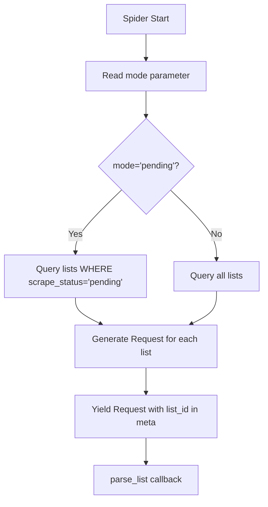
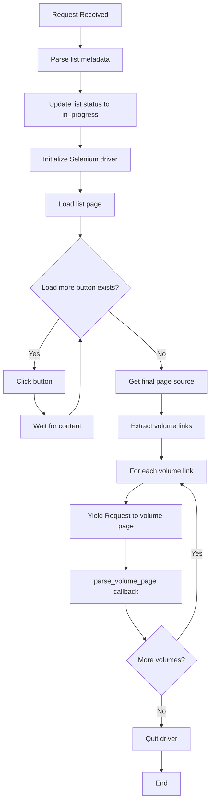
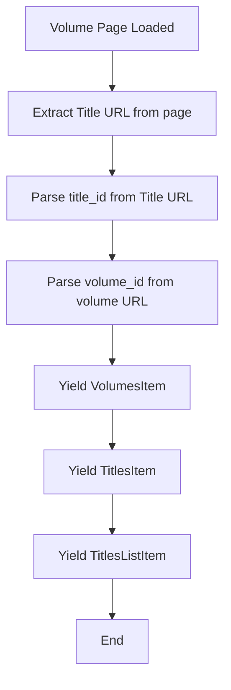

# Publications Spider Workflow

Detailed workflow for the `PublicationsSpider` that extracts volumes and titles from lists.

---

## Overview

**Spider:** `PublicationsSpider`
**File:** `whakoom_webscrapper/spiders/publications.py`
**Purpose:** Process lists to extract volumes and their parent titles
**Input:** Lists from database (by mode parameter)
**Output:** `VolumesItem`, `TitlesItem`, `TitlesListItem` instances
**Database Targets:** `volumes`, `titles`, `lists_titles` tables
**Selenium:** Yes (for dynamic content loading)

---

## Spider Configuration

```python
class PublicationsSpider(Spider):
    name = "publications"
    allowed_domains = ["whakoom.com"]

    def __init__(self, *args: Any, mode: str = "pending", **kwargs: Any) -> None:
        super().__init__(*args, **kwargs)
        self.mode = mode  # 'pending' or 'all'
        self.driver: webdriver.Chrome | None = None
```

### Command Line Options

```bash
# Process only pending lists (default)
uv run scrapy crawl publications

# Process all lists (re-scrape)
uv run scrapy crawl publications -a mode=all

# Enable debug logging
uv run scrapy crawl publications --loglevel=DEBUG

# Export to JSON for inspection
uv run scrapy crawl publications -o publications.json
```

---

## Entry Point

### `start_requests()` Method

The spider queries the database for lists to process and generates requests dynamically.

**Flow:**


### Implementation

```python
def start_requests(self) -> Iterator[Request]:
    """Generate requests for lists from database."""
    lists_to_process = self._get_lists_to_process()

    for list_data in lists_to_process:
        list_id = list_data["list_id"]
        url = list_data["url"]

        yield Request(
            url=url,
            meta={
                "list_id": list_id,
                "list_url": url,
            },
            callback=self.parse_list,
            errback=self.errback_list,
        )
```

---

## Database Query

### `_get_lists_to_process()` Method

Queries database based on mode parameter.

**Mode: 'pending'**
```python
SELECT id, list_id, title, url, user_profile, scrape_status, scraped_at
FROM lists
WHERE scrape_status = 'pending'
ORDER BY id;
```

**Mode: 'all'**
```python
SELECT id, list_id, title, url, user_profile, scrape_status, scraped_at
FROM lists
ORDER BY id;
```

---

## List Page Processing

### `parse_list()` Method

Processes a single list page using Selenium.

**Flow:**


### Step 1: Parse List Metadata

```python
user_profile = response.xpath('//*[@id="list"]/div[1]/p[2]/span[1]/strong/a/text()').get()
list_name = response.xpath('//*[@id="list"]/h1/span/text()').get()
list_amount = response.xpath('//*[@id="list"]/h1/small/text()').get()

self.logger.info(f"Scraping list '{list_name}' by user '{user_profile}' with {list_amount}.")
```

**Example:**
```
user_profile = 'deirdre'
list_name = 'Licencias Manga en Español 2025'
list_amount = '45 titles'
```

### Step 2: Update List Status

```python
self.sql_manager.update_single_field(
    "lists", "list_id", list_id, "scrape_status", "in_progress"
)
```

**Database State:**
```sql
UPDATE lists
SET scrape_status = 'in_progress'
WHERE list_id = 131178;
```

### Step 3: Initialize Selenium Driver

```python
def _init_driver(self) -> webdriver.Chrome:
    chrome_options = Options()
    chrome_options.add_argument("--headless")
    chrome_options.add_argument("--no-sandbox")
    chrome_options.add_argument("--disable-dev-shm-usage")
    chrome_options.add_argument("--disable-gpu")
    chrome_options.add_argument("--log-level=3")

    return webdriver.Chrome(options=chrome_options)
```

### Step 4: Load and Scroll Page

```python
self.driver.get(response.url)

while True:
    try:
        load_more_button = WebDriverWait(self.driver, 10).until(
            EC.element_to_be_clickable((By.ID, "loadmoreissues"))
        )
        load_more_button.click()

        WebDriverWait(self.driver, 10).until(
            EC.presence_of_element_located((By.CLASS_NAME, "list__item"))
        )
    except TimeoutException:
        self.logger.info("Selenium found no more clickable elements. Stopping pagination")
        break
    except Exception as e:
        self.logger.error("Selenium encountered an Exception: %s", e)
        break
```

**Process:**
1. Load list page in Chrome (headless)
2. Look for "Load more" button with ID `loadmoreissues`
3. If found, click button
4. Wait for new content to load
5. Repeat until button not found or timeout

### Step 5: Extract Volume Links

```python
page_source = self.driver.page_source
self.driver.quit()
self.driver = None

response_ = Selector(text=page_source)
titles = response_.xpath('//span[@class="title"]/a')

for title_element in titles:
    volume_url = title_element.attrib.get("href", "")
    volume_name = title_element.get()

    yield Request(
        url=f"www.whakoom.com{volume_url}",
        meta={
            "volume_url": volume_url,
            "volume_name": volume_name,
            "list_id": response.meta["list_id"],
        },
        callback=self.parse_volume_page,
    )
```

**Example Volume Links Found:**
```
/comics/fxTr6/rosen_blood/1  → "Rosen Blood #1"
/comics/abc123/one_piece/1 → "One Piece #1"
/comics/def457/demon_slayer/2 → "Demon Slayer #2"
```

**Note:** These are **volume URLs**, not title URLs. We'll follow each to get the parent Title URL.

---

## Volume Page Processing

### `parse_volume_page()` Method

Follows each volume link to extract the parent Title URL.

**Flow:**


### Step 1: Extract Title URL

```python
title_url = response.xpath('//*[@id="content"]/div/div/p[1]/a').attrib.get("href", "")
```

**Example:**
```
Volume URL: https://www.whakoom.com/comics/fxTr6/rosen_blood/1
Extracted Title URL: https://www.whakoom.com/ediciones/673392/rosen_blood
```

### Step 2: Parse IDs

```python
def _extract_volume_id_from_url(self, url: str) -> str:
    """Extract volume_id from volume URL.

    Example:
    https://www.whakoom.com/comics/fxTr6/rosen_blood/1 → 'fxTr6'

    Args:
        url: The volume URL.

    Returns:
        The volume ID extracted from the URL.
    """
    parts = url.rstrip('/').split('/')
    if 'comics' in parts:
        idx = parts.index('comics')
        if idx + 1 < len(parts):
            return parts[idx + 1]
    raise ValueError(f"Cannot extract volume_id from URL: {url}")

def _extract_title_id_from_url(self, url: str) -> int:
    """Extract numeric title_id from Title URL.

    Example:
    https://www.whakoom.com/ediciones/673392/rosen_blood → 673392

    Args:
        url: The Title URL.

    Returns:
        The numeric title ID.
    """
    parts = url.rstrip('/').split('/')
    if 'ediciones' in parts:
        idx = parts.index('ediciones')
        if idx + 1 < len(parts):
            return int(parts[idx + 1])
    raise ValueError(f"Cannot extract title_id from URL: {url}")
```

**Examples:**
```
Volume URL: https://www.whakoom.com/comics/fxTr6/rosen_blood/1
→ volume_id = 'fxTr6'

Title URL: https://www.whakoom.com/ediciones/673392/rosen_blood
→ title_id = 673392
```

### Step 3: Yield Items

```python
volume_url = response.meta["volume_url"]
list_id = response.meta["list_id"]
volume_name = response.meta["volume_name"]

# Extract IDs
volume_id = self._extract_volume_id_from_url(volume_url)
title_id = self._extract_title_id_from_url(title_url)

# Yield items
yield VolumesItem(
    volume_id=volume_id,
    title_id=title_id,
    url=f"www.whakoom.com{volume_url}"
)

yield TitlesItem(
    title_id=title_id,
    url=f"www.whakoom.com{title_url}",
    title=volume_name,
    scrape_status="pending"
)

yield TitlesListItem(
    list_id=list_id,
    title_id=title_id,
    position=None  # Could be set if position is available
)
```

---

## URL Format Reference

### Volume URLs

**Format:** `https://www.whakoom.com/comics/{volume_id}/{title_slug}/{volume_number}`

**Examples:**
```
https://www.whakoom.com/comics/fxTr6/rosen_blood/1
  - volume_id = 'fxTr6' (alphanumeric, unique per volume)
  - title_slug = 'rosen_blood'
  - volume_number = 1 (ignored for now)

https://www.whakoom.com/comics/abc123/one_piece/2
  - volume_id = 'abc123'
  - title_slug = 'one_piece'
  - volume_number = 2
```

**Extraction Code:**
```python
parts = url.rstrip('/').split('/')
volume_id = parts[parts.index('comics') + 1]  # e.g., 'fxTr6'
```

### Title URLs

**Format:** `https://www.whakoom.com/ediciones/{title_id}/{title_slug}`

**Examples:**
```
https://www.whakoom.com/ediciones/673392/rosen_blood
  - title_id = 673392 (numeric, unique per title)
  - title_slug = 'rosen_blood'

https://www.whakoom.com/ediciones/987654/one_piece
  - title_id = 987654
  - title_slug = 'one_piece'
```

**Extraction Code:**
```python
parts = url.rstrip('/').split('/')
title_id = int(parts[parts.index('ediciones') + 1])  # e.g., 673392
```

---

## Pipeline Processing

### VolumesItem Processing

**Database Table:** `volumes`

**SQL Query:**
```sql
INSERT INTO volumes (volume_id, title_id, url)
VALUES (?, ?, ?)
ON CONFLICT (volume_id) DO UPDATE SET
    title_id = excluded.title_id,
    url = excluded.url,
    updated_at = CURRENT_TIMESTAMP;
```

**Note:** Other fields (volume_number, isbn, publisher, year) are NULL for now. Future volume rework will populate these.

### TitlesItem Processing

**Database Table:** `titles`

**SQL Query:**
```sql
INSERT INTO titles (title_id, title, url, scrape_status, scraped_at)
VALUES (?, ?, ?, ?, ?)
ON CONFLICT (title_id) DO NOTHING;
```

**Deduplication:** `ON CONFLICT DO NOTHING` ensures the same title (same `title_id`) appearing in multiple lists only results in one entry in the `titles` table.

### TitlesListItem Processing

**Database Table:** `lists_titles` (junction table)

**SQL Query:**
```sql
INSERT INTO lists_titles (list_id, title_id, position)
VALUES (?, ?, ?);
```

**Unique Constraint:** `(list_id, title_id)` prevents duplicate list-title relationships.

---

## Spider Completion

### `close_spider()` Method

Updates list statuses and cleans up resources.

```python
def close_spider(self, spider: Spider) -> None:
    """Update list statuses to 'completed' for successfully processed lists."""
    for list_id in self.processed_list_ids:
        self.sql_manager.update_single_field(
            "lists", "list_id", list_id, "scrape_status", "completed"
        )
```

**Database State After Completion:**
```sql
UPDATE lists
SET scrape_status = 'completed'
WHERE list_id IN (131178, 131179, ...);
```

---

## Complete Execution Example

### Command
```bash
uv run scrapy crawl publications -a mode=pending
```

### Console Output
```
2026-02-01 18:00:00 [INFO] Scrape mode: pending
2026-02-01 18:00:01 [INFO] Processing list 'Licencias Manga en Español 2025' by user 'deirdre' with 45 titles.
2026-02-01 18:00:01 [INFO] ChromeDriver initialized successfully
2026-02-01 18:00:02 [INFO] Selenium found no more clickable elements. Stopping pagination
2026-02-01 18:00:03 [INFO] Processing volume: fxTr6
2026-02-01 18:00:04 [INFO] Processing title: Rosen Blood (title_id: 673392)
2026-02-01 18:00:05 [INFO] Processing volume: abc123
2026-02-01 18:00:06 [INFO] Processing title: One Piece (title_id: 987654)
...
2026-02-01 18:05:00 [INFO] Spider finished for: publications
```

### Database State

**lists table (after completion):**
| list_id | title | scrape_status |
|---------|-------|---------------|
| 131178 | Licencias Manga en Español 2025 | completed |
| 131179 | Shonen Jump 2024 | completed |

**volumes table:**
| id | volume_id | title_id | url |
|-----|-----------|-----------|-----|
| 1 | fxTr6 | 673392 | https://www.whakoom.com/comics/fxTr6/rosen_blood/1 |
| 2 | abc123 | 987654 | https://www.whakoom.com/comics/abc123/one_piece/1 |

**titles table:**
| id | title_id | title | url | scrape_status |
|-----|----------|-------|-----|---------------|
| 1 | 673392 | Rosen Blood | https://www.whakoom.com/ediciones/673392/rosen_blood | pending |
| 2 | 987654 | One Piece | https://www.whakoom.com/ediciones/987654/one_piece | pending |

**lists_titles table:**
| id | list_id | title_id |
|-----|---------|-----------|
| 1 | 123 | 673392 |
| 2 | 123 | 987654 |

---

## Error Handling

### Request Error Callback

```python
def errback_list(self, failure: Failure) -> Iterator[None]:
    """Handle request failures."""
    list_id = failure.request.meta["list_id"]

    self.logger.error("Request failed for list_id %s: %s", list_id, failure)

    self.sql_manager.update_single_field(
        "lists", "list_id", list_id, "scrape_status", "failed"
    )
```

### Common Errors

**Selenium Timeout**
```
TimeoutException: Element not found
```
- **Cause:** Slow page load or network issues
- **Mitigation:** Increase timeout in `WebDriverWait`

**URL Parsing Error**
```
ValueError: Cannot extract title_id from URL: https://...
```
- **Cause:** URL format changed
- **Mitigation:** Add fallback logic or update regex patterns

**Database Lock**
```
OperationalError: database is locked
```
- **Cause:** Concurrent access or unclosed connection
- **Mitigation:** Ensure no other processes access DB, close connections properly

---

## Common Issues

### Issue: No volumes found

**Symptom:** List page loads but yields no volume items.

**Possible Causes:**
1. XPath selector changed on Whakoom
2. Selenium not waiting for dynamic content
3. List is empty

**Debug Steps:**
```bash
# Enable debug logging
uv run scrapy crawl publications --loglevel=DEBUG

# Check for volume links in logs
# Look for: "Found X volume links"
```

### Issue: Title URL extraction fails

**Symptom:** `ValueError: Cannot extract title_id from URL`

**Possible Cause:** Parent Title link XPath changed

**Debug Steps:**
```bash
# Export volume page HTML to inspect
uv run scrapy shell "https://www.whakoom.com/comics/fxTr6/rosen_blood/1"
response.xpath('//*[@id="content"]/div/div/p[1]/a').attrib.get("href")
```

### Issue: Duplicate volume entries

**Symptom:** Same volume appears multiple times in database

**Cause:** `ON CONFLICT` not working or volume_id not unique

**Solution:** Ensure SQL query uses `ON CONFLICT (volume_id) DO UPDATE`

---

## Related Documentation

- [Complete Scraping Workflow](scraping-flow.md) - End-to-end flow with real examples
- [List Spider Workflow](list-spider-workflow.md) - Previous stage in pipeline
- [Title Spider Workflow](title-spider-workflow.md) - Next stage (future)
- [Database Schema](../database/schema.md) - Complete database reference
- [SQLManager Guide](../database/sqlmanager-guide.md) - SQLManager usage
- [Troubleshooting](../development/troubleshooting.md) - Common issues and solutions
