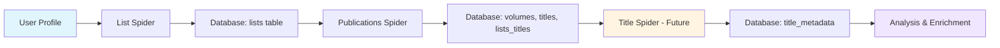
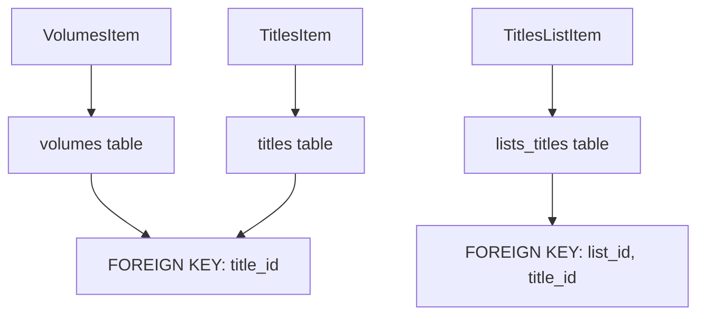
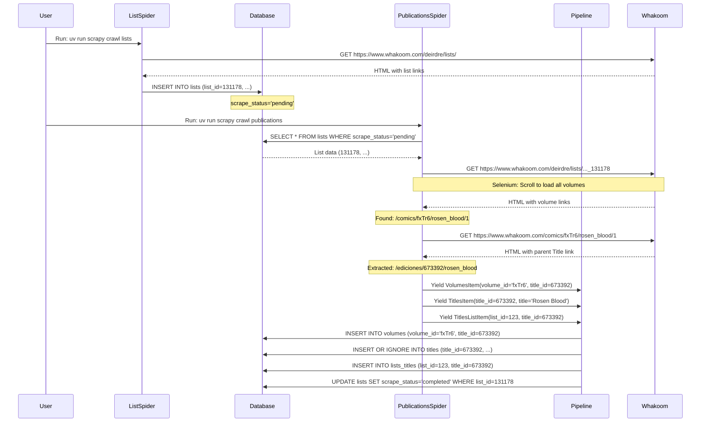
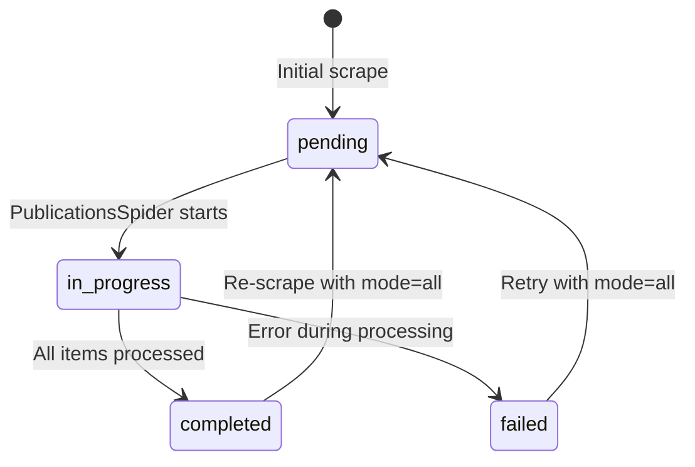
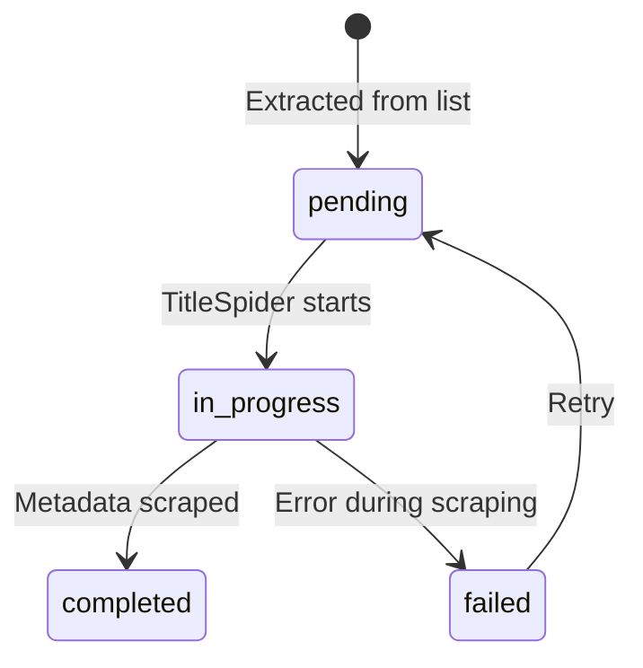

# Complete Scraping Workflow

End-to-end scraping workflow with real Whakoom examples and data flow diagrams.

---

## Overview

The scraping workflow follows a multi-stage pipeline:

1. **List Collection** - Scrape all lists from user profile
2. **Publication Processing** - Extract volumes and titles from each list
3. **Title Metadata Scraping** (Future) - Get detailed title information
4. **Data Analysis** - Statistical analysis, NLP, semantic enrichment

---

## High-Level Workflow Diagram



---

## Stage 1: List Collection

### Purpose
Collect all user-defined lists from a Whakoom user profile.

### Input
```
https://www.whakoom.com/deirdre/lists/
```

### Process
1. **ListSpider** fetches user profile page
2. Parses HTML to find list links
3. Extracts list metadata (title, ID, URL)
4. Yields `ListsItem` for each list
5. Pipeline stores items in `lists` table with `scrape_status='pending'`

### Output
Database entries in `lists` table:

| list_id | title | url | user_profile | scrape_status |
|----------|-------|-----|--------------|----------------|
| 131178 | Licencias Manga en Español 2025 | https://www.whakoom.com/deirdre/lists/licencias_manga_en_espana_2025_131178 | deirdre | pending |
| 131179 | Shonen Jump 2024 | https://www.whakoom.com/deirdre/lists/shonen_jump_2024_131179 | deirdre | pending |

### Command
```bash
uv run scrapy crawl lists
```

---

## Stage 2: Publication Processing

### Purpose
Process each list to extract volumes and their parent titles.

### Input
Lists from database with `scrape_status='pending'` (or all if `mode=all`)

### Process Per List

#### Step 2.1: List Page Processing

**Example URL:**
```
https://www.whakoom.com/deirdre/lists/licencias_manga_en_espana_2025_131178
```

**Action:**
1. **PublicationsSpider** fetches list page using Selenium
2. Scrolls to load all volumes (lazy loading)
3. Extracts volume links from `//span[@class="title"]/a` elements
4. Each link is a **volume URL**, not a title URL

**Example Volume Links Found:**
```
https://www.whakoom.com/comics/fxTr6/rosen_blood/1
https://www.whakoom.com/comics/abc123/one_piece/1
https://www.whakoom.com/comics/def457/demon_slayer/2
```

**Status Update:** List status set to `'in_progress'`

#### Step 2.2: Volume Page Processing

For each volume URL:

**Example Volume URL:**
```
https://www.whakoom.com/comics/fxTr6/rosen_blood/1
```

**Action:**
1. Spider follows volume link
2. Extracts parent **Title URL** from volume page
3. Parses IDs from both URLs:
   - **volume_id** = `fxTr6` (from volume URL)
   - **title_id** = `673392` (from title URL)

**Extracted Title URL:**
```
https://www.whakoom.com/ediciones/673392/rosen_blood
```

**Items Yielded:**

1. **VolumesItem:**
   ```python
   VolumesItem(
       volume_id='fxTr6',
       title_id=673392,
       url='https://www.whakoom.com/comics/fxTr6/rosen_blood/1'
   )
   ```

2. **TitlesItem:**
   ```python
   TitlesItem(
       title_id=673392,
       title='Rosen Blood',
       url='https://www.whakoom.com/ediciones/673392/rosen_blood',
       scrape_status='pending'
   )
   ```
   - Note: `INSERT OR IGNORE` prevents duplicates if title exists

3. **TitlesListItem:**
   ```python
   TitlesListItem(
       list_id=123,  # Database list ID
       title_id=673392,
       position=1
   )
   ```

#### Step 2.3: Database Storage

Pipeline processes items:



**Database State After Processing List:**

**volumes table:**
| id | volume_id | title_id | url |
|-----|-----------|-----------|-----|
| 1 | fxTr6 | 673392 | https://www.whakoom.com/comics/fxTr6/rosen_blood/1 |
| 2 | abc123 | 987654 | https://www.whakoom.com/comics/abc123/one_piece/1 |

**titles table (deduplicated):**
| id | title_id | title | url | scrape_status |
|-----|----------|-------|-----|---------------|
| 1 | 673392 | Rosen Blood | https://www.whakoom.com/ediciones/673392/rosen_blood | pending |
| 2 | 987654 | One Piece | https://www.whakoom.com/ediciones/987654/one_piece | pending |

**lists_titles table (junction):**
| id | list_id | title_id | position |
|-----|---------|-----------|----------|
| 1 | 123 | 673392 | 1 |
| 2 | 123 | 987654 | 2 |

**Status Update:** List status set to `'completed'`

### Output
- Volumes stored in `volumes` table
- Titles stored in `titles` table (deduplicated)
- List-title relationships in `lists_titles` table

### Command
```bash
# Process only pending lists
uv run scrapy crawl publications -a mode=pending

# Process all lists (re-scrape)
uv run scrapy crawl publications -a mode=all
```

---

## Stage 3: Title Metadata Scraping (Future)

### Purpose
Scrape detailed metadata for each title (author, publisher, description, etc.)

### Input
Titles from database with `scrape_status='pending'`

### Process
1. **TitleSpider** reads pending titles
2. For each title, fetches the Title page
3. Extracts metadata (author, publisher, demographic, etc.)
4. Yields `TitleMetadataItem`
5. Pipeline stores in `title_metadata` table
6. Updates title status to `'completed'`

### Example
**Title URL:**
```
https://www.whakoom.com/ediciones/673392/rosen_blood
```

**Extracted Metadata:**
```python
TitleMetadataItem(
    title_id=673392,
    author='Kureishi',
    publisher='Panini Manga',
    demographic='Shojo',
    genre='Fantasy',
    themes=['Vampires', 'Romance'],
    description='Chloe lives in a world...',
    start_year=2018,
    status='Completed'
)
```

### Command (Future)
```bash
uv run scrapy crawl titles
```

---

## Stage 4: Data Analysis & Enrichment (Future)

### Purpose
Analyze scraped data and enrich with external sources.

### Processes

1. **Statistical Analysis**
   - Titles by publisher
   - Distribution by demographic
   - Publication year trends
   - List popularity metrics

2. **NLP Analysis**
   - Description text analysis
   - Genre clustering
   - Similarity detection

3. **Semantic Enrichment**
   - MyAnimeList data (ratings, popularity)
   - MangaUpdates data (reviews, tags)
   - AniList data (characters, staff)

4. **Title Enriched Table:**
```python
TitleEnrichedItem(
    title_id=673392,
    cover_url='https://...',
    rating=7.5,
    rating_count=1234,
    popularity_rank=456,
    myanimelist_url='https://myanimelist.net/manga/...',
    mangaupdates_url='https://www.mangaupdates.com/series/...',
    anilist_url='https://anilist.co/manga/...'
)
```

---

## Complete Data Flow Example

### Real-World Scenario

**User Profile:** `deirdre`

**List:** "Licencias Manga en Español 2025" (list_id=131178)

**Volume in List:** Rosen Blood Volume 1



---

## URL Format Reference

### Volume URLs
**Format:** `https://www.whakoom.com/comics/{volume_id}/{title_slug}/{volume_number}`

**Examples:**
- `https://www.whakoom.com/comics/fxTr6/rosen_blood/1`
  - `volume_id` = `fxTr6` (alphanumeric)
  - `title_slug` = `rosen_blood`
  - `volume_number` = `1`

- `https://www.whakoom.com/comics/abc123/one_piece/2`
  - `volume_id` = `abc123`
  - `title_slug` = `one_piece`
  - `volume_number` = `2`

### Title URLs
**Format:** `https://www.whakoom.com/ediciones/{title_id}/{title_slug}`

**Examples:**
- `https://www.whakoom.com/ediciones/673392/rosen_blood`
  - `title_id` = `673392` (numeric)
  - `title_slug` = `rosen_blood`

- `https://www.whakoom.com/ediciones/987654/one_piece`
  - `title_id` = `987654`
  - `title_slug` = `one_piece`

### List URLs
**Format:** `https://www.whakoom.com/{user_profile}/lists/{list_name}_{list_id}`

**Examples:**
- `https://www.whakoom.com/deirdre/lists/licencias_manga_en_espana_2025_131178`
  - `user_profile` = `deirdre`
  - `list_name` = `licencias_manga_en_espana_2025`
  - `list_id` = `131178`

---

## Status Transitions

### List Status Flow


### Title Status Flow


---

## Deduplication Example

### Scenario: Same Title in Multiple Lists

**List 1:** "Licencias Manga en Español 2025"
- Contains: Rosen Blood (volume_id='fxTr6', title_id=673392)

**List 2:** "Favorite Shonen Manga"
- Contains: Rosen Blood (volume_id='ghi789', title_id=673392)
- Different volume ID, same title ID

### Database Result

**volumes table:**
| id | volume_id | title_id |
|-----|-----------|-----------|
| 1 | fxTr6 | 673392 |
| 2 | ghi789 | 673392 |

**titles table:**
| id | title_id | title |
|-----|----------|-------|
| 1 | 673392 | Rosen Blood |

**lists_titles table:**
| id | list_id | title_id |
|-----|---------|-----------|
| 1 | 123 | 673392 |
| 2 | 456 | 673392 |

**Result:**
- ✅ Two volume entries (different volumes of same title)
- ✅ One title entry (deduplicated by `title_id`)
- ✅ Two list-title relationships (title in two lists)

---

## Related Documentation

- [List Spider Workflow](list-spider-workflow.md) - Detailed list spider process
- [Publications Spider Workflow](publications-spider-workflow.md) - Detailed publications spider process
- [Title Spider Workflow](title-spider-workflow.md) - Future title spider documentation
- [Database Schema](../database/schema.md) - Complete database reference
- [Getting Started](../getting-started.md) - Quick start guide
